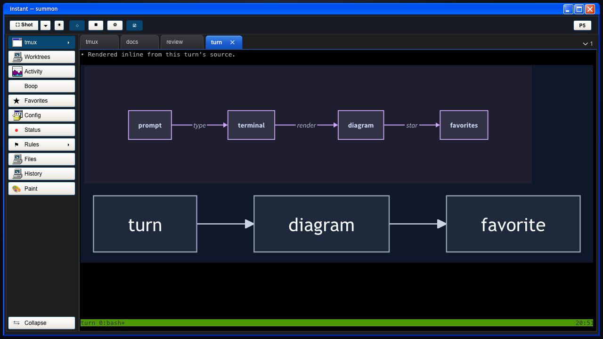
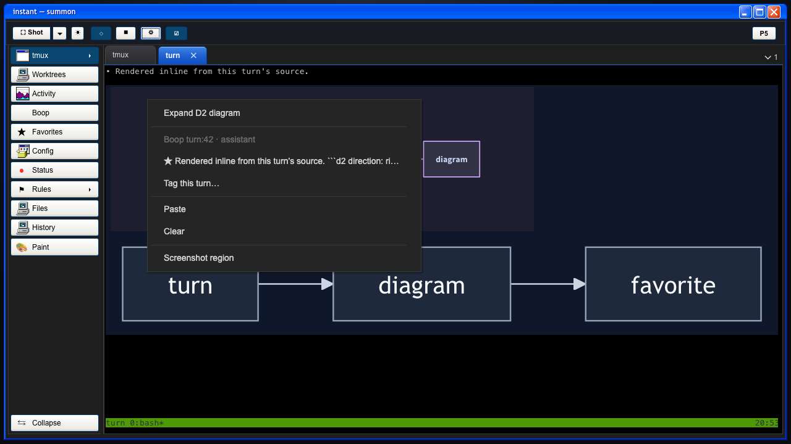
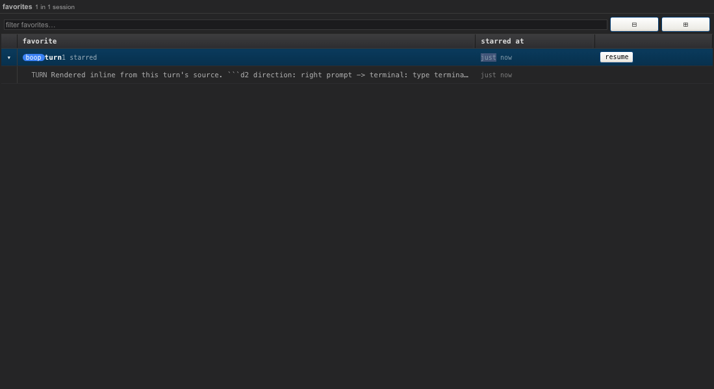
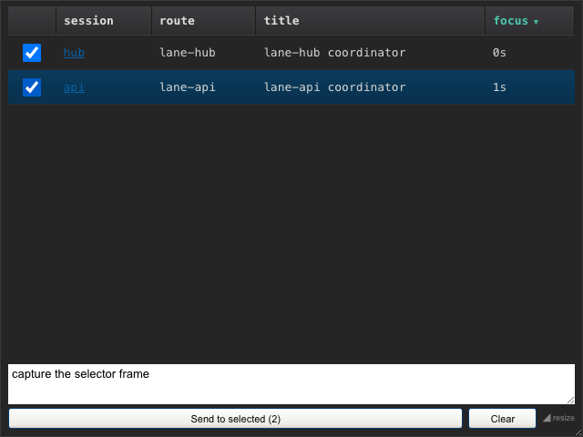
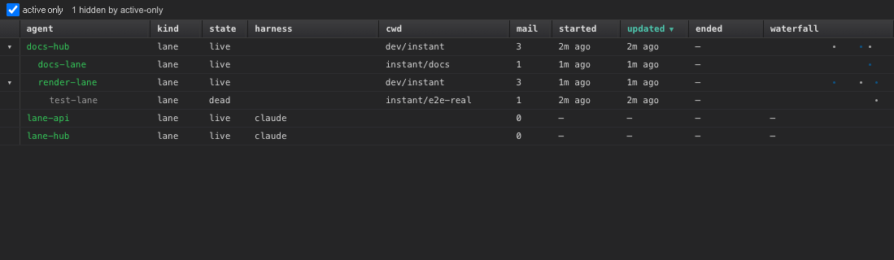

# instant

A macOS summon-overlay terminal. Double-tap right-⌘ (or double right-click) and
a frameless window drops in at your cursor, hosting tmux sessions that run AI CLI
agents (claude, opencode, codex, or a plain shell). It lives in the menu bar, not
the Dock, so it is one gesture away and gone again.

Built with Tauri 2 + TypeScript. The chrome is a retro skin (Windows XP Luna,
Persona 5, Armored Core 3 garage), the layout is a VS Code-style dockview, and a
built-in activity recorder keeps a local timeline of what you touch.

> Built almost entirely with AI (Claude Code). MIT licensed.

## Screenshots

Captures are the built bundle in Chromium against the real Rust backend, driven
through the app's own paths with synthetic sessions, turns, lanes, and mail. The
summon gesture itself is macOS-only and is not pictured.

**Durable tmux terminals render agent diagrams inline.** Three sessions are open
as dock tabs; the active one is a turn whose D2 and Mermaid fences render as
diagrams over the rows of a synthetic assistant turn: D2 above, Mermaid below.
Rustdoc rendering is pending.



**Right-click a turn to favorite it, backed by Boop.** The context menu names the
Boop turn (`turn:42 · assistant`) and offers the star. Favorites are saved in
Boop's SQLite store.



**Favorites come back from the store.** After a reload, the Favorites panel lists
the saved turn, ready to revisit.



**Pick the running TUIs a message goes to.** The tmux rail's Boop dropdown lists
coordinator sessions that are open in the dock, each with a checkbox and a
persisted selection. Two named coordinators are checked here and the send button
counts the visible set.



**Watch the Boop lane roster and mail.** The Boop panel nests lanes by who
spawned whom and rolls up each lane's mail count, recency, and a per-lane mail
waterfall.



To regenerate the images, see [docs/screenshots/README.md](docs/screenshots/README.md).

## How it works

1. **Summon.** Double-tap right-⌘ or double right-click shows or hides the window
   at the cursor. It is a menu-bar accessory app with no Dock tile and no
   Cmd-Tab entry.
2. **Terminals.** Each tab is a `tmux new-session -A` attach, so the agent inside
   keeps running when the window hides or the front end reloads. Tabs are
   draggable, splittable dockview panels; build columns by dragging.
3. **Diagrams and previews.** Mermaid and D2 fences in agent output render inline
   over the terminal turn they came from, and a click opens a zoomable lightbox.
   ⌘-click a file path in the output to open a preview tab: source in Monaco,
   rendered Markdown, or an image or PDF.
4. **Favorite turns.** Right-click a turn and pick the star. The favorite is keyed
   by `session:turn` and written to boop's store, so it survives a reload and
   shows up in the Favorites panel. `⌘⇧S` favorites the latest turn of the active
   tab from the keyboard.
5. **Message running agents.** Open the tmux rail's Boop dropdown, tick the
   coordinator TUIs you want, type a message, and send to that set. Recipients
   are Boop-controlled live TUIs open in Instant tabs.
6. **Watch Boop.** The Boop panel shows the lane roster and the mail stream over
   boop's store, refreshed live.

## Features

A section-by-section inventory lives in [docs/FEATURES.md](docs/FEATURES.md).
Highlights beyond the workflow above:

- **Worktree hub.** Repo to checkout to git worktrees as a tree; add a worktree
  inline, open a session in it, or resume a session already in that path.
- **Boop-backed favorites.** Right-click a turn and pick the star. The favorite is
  keyed by `session:turn` and written to boop's store, so it survives reloads and
  lists in the Favorites panel.
- **Activity recorder.** An fzf-searchable timeline of session visits, browser
  events (via the bundled extension), file opens, and screen captures. Off by
  default; see Privacy.
- **Retro skins.** `xp` (Windows XP Luna, light and dark), `p5` (Persona 5), and
  `ac3` (Armored Core 3 garage), one token block each.
- **iTerm2-style keybindings** in the terminal (Opt+←/→ word motion, Cmd+←/→ line
  motion, and more).

## Requirements

- macOS (CGEventTap, screencapture, and the menu bar are macOS-only).
- `tmux` on `PATH` (the Homebrew location is added automatically).
- An agent CLI if you want one: `claude`, `opencode`, and/or `codex`.
- Permissions on first run: **Accessibility / Input Monitoring** (summon gesture,
  send-selection tap) and **Screen Recording** (the Shot button and capture).

## Install

Install the current GitHub Release with:

```sh
curl -fsSL https://github.com/hafley66/instant/releases/latest/download/instant-installer.sh | sh
```

It downloads the matching architecture DMG, installs `instant.app` in
`~/Applications`, clears its quarantine attributes before first launch, and needs
no Rust, Node, pnpm, or dependency install. The prior installed bundle, if any,
is moved to a timestamped `.backup` sibling. macOS asks for Accessibility and
Input Monitoring, then Screen Recording, when those features are first used.

## Develop

Building from source needs the Rust toolchain plus
[Tauri 2 prerequisites](https://v2.tauri.app/start/prerequisites/).

```sh
corepack pnpm@10.12.4 install
corepack pnpm@10.12.4 run tauri dev      # Rust backend + front end
```

`just dev-safe` starts a second instance with the tray, global shortcut, and
summon gesture disabled, for development alongside an already-running app.

Check and build:

```sh
corepack pnpm@10.12.4 exec tsc --noEmit
corepack pnpm@10.12.4 run build
cargo check --manifest-path src-tauri/Cargo.toml
```

## Privacy

The activity recorder is **off by default** and toggled explicitly (Activity
panel or the menu-bar item). It records only Cmd+C/Cmd+V keycodes, not
keystrokes; never captures while an excluded app is frontmost or while the
instant window is focused; and drops events matching the config exclusion filters
before they are stored. Activity data is stored locally under
`~/Library/Application Support/com.instant.summon/`.

## License

MIT. See [LICENSE](LICENSE).
