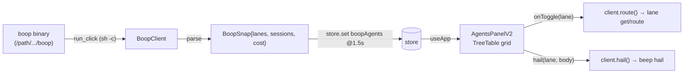

# Agents (boop) — shell v2 pass 1

Lane/agent visibility + hail in instant, driven by the docs'd boop binary
exclusively. No new code touches `scripts/bus.ts` or execs tmux directly; every
read and every action shells out to boop through the existing `run_click` tauri
command (`/bin/sh -c`).

## TOC

- What landed
- BOOP verbs this build shells out to
- Fixtures committed
- Tests
- Reality deviations (vs brief)
- What pass 2 needs

## What landed

| module | file | role |
| --- | --- | --- |
| data source | `src/boopAgents.ts` (343) | pure parsers + `BoopClient` + `startBoopPolling` |
| panel | `src/agentsPanelV2.tsx` (207) | TreeTable grid: lanes → route detail, hail action |
| registration | `src/panels.ts` + `src/main.ts` | builtin `agents` rail panel; poll+bridge wiring |
| state | `src/state.ts` | runtime `boopAgents` slice (not persisted) |
| unit tests | `src/boopAgents.test.ts`, `scripts/boop_parse.test.ts` | inline + captured-fixture parsing |
| e2e | `scripts/boop_lane.test.ts` | spawn-contract + patch/read/hail over real boop |



The app runs in a browser (`just web`) invoke no-ops; polling catches and keeps
the last snap, so the panel degrades to "no boop lanes" rather than crashing.

## BOOP verbs used

| verb | purpose | cadence |
| --- | --- | --- |
| `beep lane list` | lanes + live/dead/harness/mode/model/tmux/cwd | every tick |
| `beep ps` | pid / rss_kb / cpu_pct / uptime / children per lane | every tick |
| `db session list --limit 8 --format ndjson` | recent sessions | every 5th tick |
| `db usage --limit 1 --format ndjson` | totals row (calls, cost) | every 5th tick |
| `beep lane get <lane>` | route JSON on expand | on expand |
| `beep lane route <lane>` | resolved session id on expand | on expand |
| `beep hail <lane> --body … --from instant` | row action | on hail |

Output shapes parsed: lane list is a fixed-width table (state name harness mode
model tmux cwd; model 46-wide, cwd trailing); `ps` is TSV; `db … --format ndjson`
is JSON-lines; `lane get` is a single JSON object; `lane route` is a human line
`resolved X -> <session>`.

The binary path is pinned in `src/boopAgents.ts` (`BOOP_BIN`): the shimmed
`boop` on PATH is an older schema and refuses the v5 store.

## Fixtures committed

`fixtures/boop/`, captured from a real run of this exact binary:

- `lane-list.txt` — 103 lanes
- `ps.tsv` — 103 rows
- `sessions.ndjson` — 5 recent sessions
- `usage.ndjson` — totals + unpriced rows
- `lane-get-live.json`, `lane-get-dead.json`, `lane-route.txt`

## Tests

`just test` (vitest, node env):

```
Test Files  75 passed (75)
     Tests  521 passed (521)
```

Included: 10 inline parse/poll tests (`src/boopAgents.test.ts`), 8 parsing tests
against the committed fixtures + a fake-runner `BoopClient.poll` integration
(`scripts/boop_parse.test.ts`), and the e2e (`scripts/boop_lane.test.ts`) — 2
cases, both passing here (tmux present). Gates: `just check`, `just build`,
`just ext-build`, `just cargo-check` all green.

e2e tail:

```
✓ boop lane spawn + hail e2e > dry-run lane create prints the literal spawn contract
✓ boop lane spawn + hail e2e > patches a route, reads get/route/ps, and hails
```

## Reality deviations vs brief

1. `beep lane patch` has no `--socket` flag — it always talks to the default
   tmux server. `beep lane create --socket` is the only socket-aware spawner and
   it launches a real harness. The e2e therefore runs a `sleep 30` pane on the
   default server under a unique name (kills only that session, never the
   server) and asserts the create spawn contract via `--dry-run`.
2. `--dry-run` prints the harness launch line + `to:` — it does not surface the
   `--socket` in its output, so the e2e asserts the spawn contract, not the
   socket flag.
3. `beep ps` reports a dead lane's pid as `0`, not `-`; only rss/cpu/uptime are
   `-`. The parser + tests reflect that.

## What pass 2 needs

- Spawn form: a `+ lane` row action → `boop beep lane create` (needs a `--cmd`
  override in boop for cheap/integration spawning, or a real harness launch).
- Kill: `beep lane delete`/`beep <lane> stop` wiring on a row (out of scope now).
- Route-to-pane click-through: expand a lane → jump to its tmux pane via the
  existing `openTab` path.
- Per-lane session/cost attribution (currently a global summary from `db usage`).
- Optional delta stream (decided against; polling is the mode).
