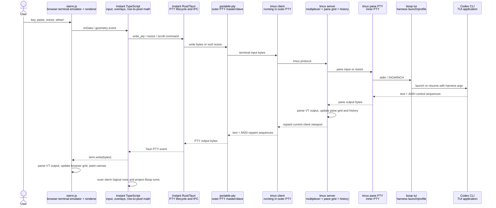
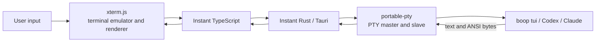
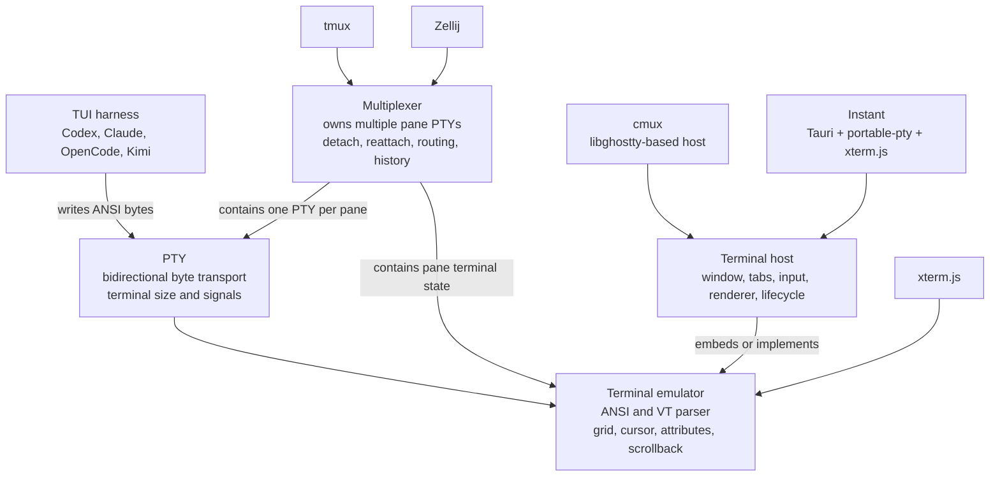
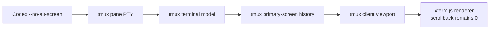
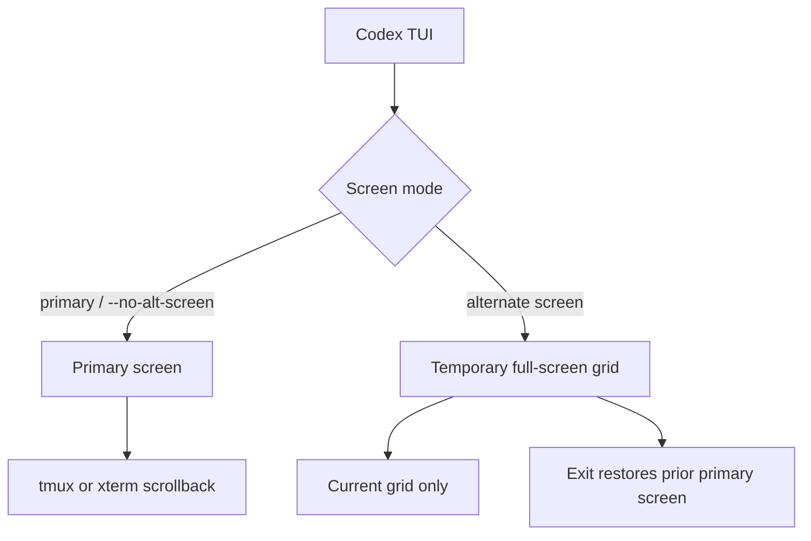

# Instant terminal stack flow

## Current tmux-backed path

The tmux-backed path contains two terminal-state machines. Tmux models its
pane grid and history. Xterm.js models and renders the tmux client's output.

## Direct PTY path

The direct path removes the tmux client, tmux server, and tmux pane PTY.
Portable-pty remains the byte transport. Xterm.js remains the terminal emulator
and renderer.

## Technology roles

## Codex inline mode with tmux history

`codex --no-alt-screen` keeps Codex on the primary screen. Lines displaced
from the pane can enter tmux history. The flag does not remove the PTY, tmux,
or xterm.js.

## Screen-buffer behavior

## Current implementation notes

- Instant uses `portable-pty` in `src-tauri/src/pty.rs`.
- Instant uses `@xterm/xterm` in `src/terminal.ts`.
- Tmux-backed terminals currently set xterm.js `scrollback: 0` because tmux
  owns history.
- Direct PTY mode already exists behind `INSTANT_DIRECT_PTY=1`, but xterm.js
  scrollback is currently set to zero unconditionally and requires a
  host-dependent value before direct mode retains history.
- Codex CLI 0.151.0 exposes `--no-alt-screen` for inline rendering with terminal
  scrollback.
- Boop harnesses should consume terminal snapshots or logical grids. Tmux,
  direct PTY, Zellij, and other hosts remain snapshot providers.
