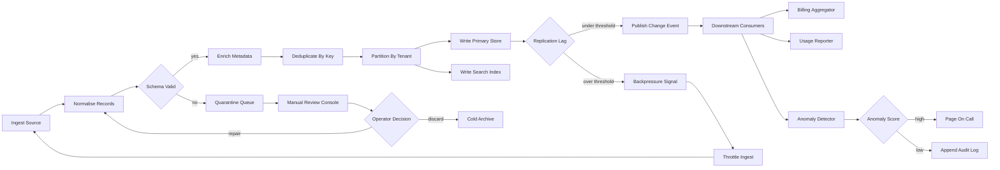
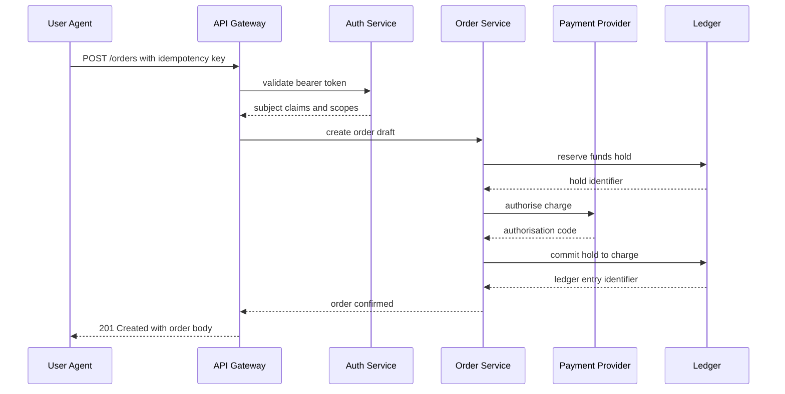
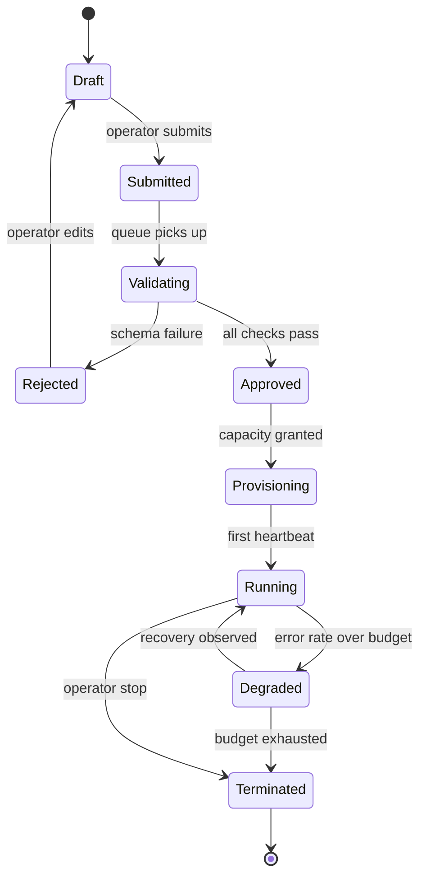
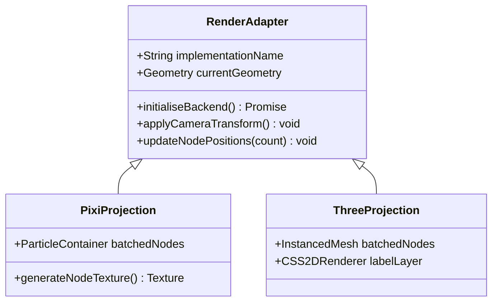

# Mermaid fuzz repro

Two render paths to check. Say which one is fuzzy.

| path | how to reach it | what to look at |
| --- | --- | --- |
| inline overlay | `cat labs/mermaid-fuzz-repro.md` in a terminal tab | the diagram drawn over the terminal rows |
| lightbox | click that overlay to expand | the full-screen viewer, zoom with cmd+wheel |
| mdview | open this file in a preview tab | the rendered markdown panel |

## 1. Large flowchart, 24 nodes

## 2. Wide sequence diagram

## 3. State machine

## 4. Class diagram with long member names

