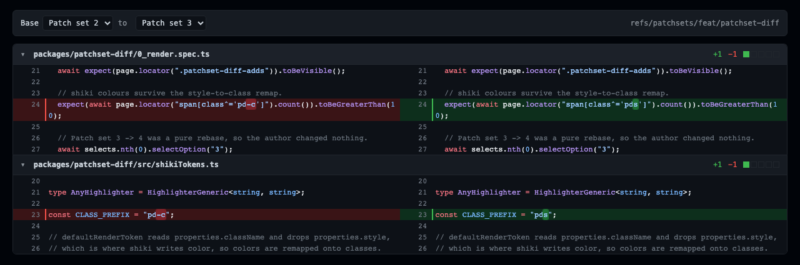

# @hafley/patchset-diff

Read diffs between patch sets of one change, without a review server.



## TOC

1. What it solves
2. Install
3. Quickstart: the whole picker
4. React: one diff only
5. Web component
6. Syntax highlighting
7. Patch-set sources
8. Recording patch sets with git
9. Images
10. Receipts
11. Known gaps

## 1. What it solves

`git diff A B` compares two trees, so a rebased patch set shows every upstream
change the rebase dragged in. An interdiff diffs each patch set against its own
parent first, then compares those, so upstream movement cancels out.

| Case | `git diff PS1 PS2` | `jj interdiff --from PS1 --to PS2` |
|---|---|---|
| pure rebase, author changed nothing | shows upstream's edits | empty |
| author edited one line | shows that line | shows that line |

## 2. Install

```sh
pnpm add @hafley/patchset-diff react react-dom react-diff-view shiki
```

`react-diff-view` and `shiki` are peer dependencies; `shiki` is optional.

## 3. Quickstart: the whole picker

`PatchRange` is the Gerrit patch-range selector: two dropdowns, the interdiff
between them, images, and collapsible files. It needs a `PatchsetSource` and a
change id, nothing else.

```tsx
import { PatchRange, jjSource, shikiRefractor } from "@hafley/patchset-diff";
import { createHighlighter } from "shiki";
import "@hafley/patchset-diff/style.css";

const highlighter = await createHighlighter({ themes: ["github-dark"], langs: ["text"] });
const { refractor, install } = shikiRefractor(highlighter, "github-dark");
install();

<PatchRange source={jjSource(run)} changeId="tnrtopsxomqt" viewType="split" refractor={refractor} />
```

Base defaults to the second-newest patch set and target to the newest, which is
the "what did I just change" view.

## 4. React: one diff only

```tsx
import { PatchsetDiff } from "@hafley/patchset-diff/react";

<PatchsetDiff
  diffText={text}
  viewType="split"
  refractor={refractor}
  empty={<p>No change between these patch sets.</p>}
/>
```

| Prop | Effect |
|---|---|
| `diffText` | unified diff, e.g. from `jj interdiff --git` |
| `refractor` | colour; omit for plain text |
| `widgets` | node anchored below a line, keyed by `getChangeKey(change)` |
| `empty` | shown when the diff is empty, i.e. a pure rebase |
| `image` | `(path, side) => data URL`, for binaries git reports without hunks |
| `imageDiff` | `(path) => { src, changed }`, the pixel difference |

Files mount on `IntersectionObserver` with a 400px margin, and each file header
collapses its own table.

## 5. Web component

```html
<link rel="stylesheet" href="@hafley/patchset-diff/style.css" />
<patchset-diff view-type="split"></patchset-diff>
```

```js
import "@hafley/patchset-diff/element";

const el = document.querySelector("patchset-diff");
el.diffText = await source.interdiff(ps1.commitId, ps2.commitId);
el.refractor = refractor;
el.widgets = { [changeKey]: commentThreadNode };
```

| Surface | Kind | Why |
|---|---|---|
| `diffText`, `refractor`, `widgets` | property | attributes are strings, so objects cannot pass through them |
| `view-type` | attribute | primitive, so plain HTML and non-React hosts can set it |
| `diff-text` | attribute | convenience for small inline diffs |

React 19 sets a property when the custom element declares one and falls back to
an attribute otherwise, so the same element works from React and from plain DOM.
React 18 and earlier stringify objects to `[object Object]`.

Light DOM, no shadow root, so one stylesheet themes every instance.

## 6. Syntax highlighting

```ts
const highlighter = await createHighlighter({ themes: ["github-dark"], langs: ["text"] });
const { refractor, install } = shikiRefractor(highlighter, "github-dark");
const uninstall = install();
```

`install()` is required and returns a remover. Colours are minted lazily as
files render, so a stylesheet built once at startup would be empty; `install`
keeps a `<style>` repainting instead. `css()` returns the current rules if you
would rather own the element.

Grammars load per file. `refractor.ensure(language)` resolves once a language is
resident and false when no grammar exists, and `highlight` falls back to plain
text rather than throwing, so preloading `["text"]` is enough. First paint of a
file is uncolored for a tick.

`react-diff-view`'s `defaultRenderToken` reads `properties.className` and drops
`properties.style`, which is where shiki writes colour. `shikiRefractor` remaps
each colour onto a generated class.

Intraline marks come from `markEdits`, applied in `DiffView.tsx`, so an edit
paints the changed words rather than the whole line.

## 7. Patch-set sources

```ts
import { jjSource, gitSource, type Run } from "@hafley/patchset-diff/jj";

const run: Run = async (bin, args) => (await execFile(bin, args, { cwd })).stdout;

const source = jjSource(run);
const sets = await source.listPatchsets("tnrtopsxomqt");
const text = await source.interdiff(sets[0].commitId, sets[1].commitId);
```

| Backend | Change id is | Patch-set store | Rebase noise |
|---|---|---|---|
| `jjSource` | a jj change id | `jj evolog`, built in | cancelled by `jj interdiff` |
| `gitSource` | `refs/patchsets/<branch>` | refs under that prefix, `/1`, `/2`, ... | present; `interdiff` compares trees |

`Run` is the only host dependency. In a browser it is a fetch to something that
shells out; `devRun.ts` is the dev-server version, an allowlisted `/_run` route
that never reaches a build.

jj records only what jj does. Rebasing with `git rebase` in a colocated repo
leaves the old commit unreachable, and `jj interdiff` then reports
`Revision ... doesn't exist`.

## 8. Recording patch sets with git

`gitSource` reads whatever a pre-push hook wrote:

```sh
#!/bin/sh
branch=$(git rev-parse --abbrev-ref HEAD)
n=$(git for-each-ref --format='%(refname)' "refs/patchsets/$branch/" | wc -l)
git update-ref "refs/patchsets/$branch/$((n + 1))" HEAD
```

Install it at `$(git rev-parse --git-common-dir)/hooks/pre-push`, not
`--git-dir`. Inside a worktree those differ and git reads the common one, so a
hook written to `--git-dir` silently never runs.

## 9. Images

Binary files arrive with no hunks, so `image(path, side)` supplies each side and
the view draws them side by side. When both sides exist and `imageDiff` is given,
a "difference" toggle appears with a changed-pixel count.

`PatchRange` implements both: sides come from `git show <commit>:<path>` in
base64, and the difference is a `POST /_compare` that runs
`magick compare -metric AE`. `compare` exits 1 when images differ, which is the
normal path, so only other exit codes are treated as failures.

Panes cap at `--pd-image-max` (22rem) with `object-fit: contain`.

## 10. Receipts

```sh
pnpm vite --port 5201 --strictPort
pnpm playwright test --config packages/patchset-diff/playwright.config.ts
```

| Spec | Proves |
|---|---|
| `0_render.spec.ts` | jj lab repo: 4 patch sets, a real edit at 1 to 4, an empty pure rebase at 3 to 4 |
| `1_dogfood.spec.ts` | this package's own `refs/patchsets/`: intraline narrower than the line, colour on every file of the newest pair, collapse toggle |
| `2_images.spec.ts` | image pair, difference mode, pane within the cap |

Fixtures in `src/fixture.ts` are captured from real `jj` output in a colocated
repo, not hand-written.

## 11. Known gaps

| Gap | State |
|---|---|
| `/_compare` | dev-server middleware; a real host must own the compare |
| Large-diff behaviour | per-file `IntersectionObserver` mount; not measured against a many-file diff |
| Comment threads | the `widgets` anchor slot is wired; the thread UI is the caller's |
| Test parallelism | `workers: 1`; the contention between specs is not diagnosed |
| Grammar flash | a file paints plain for one tick before its grammar lands |
