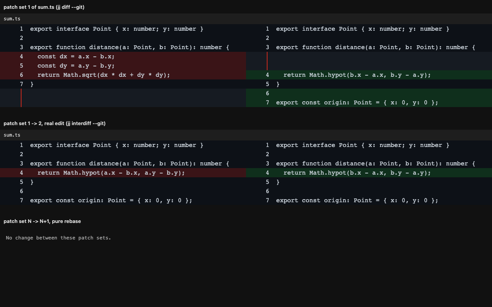

# @hafley/patchset-diff

Read diffs between patch sets of one change, without a review server.



## TOC

1. What it solves
2. Install
3. Web component
4. React
5. Patch-set sources
6. Receipts
7. Known gaps

## 1. What it solves

`git diff A B` compares two trees, so a rebased patch set shows every upstream
change the rebase dragged in. An interdiff diffs each patch set against its own
parent first, then compares those, so upstream movement cancels out.

| Case | `git diff PS1 PS2` | `jj interdiff --from PS1 --to PS2` |
|---|---|---|
| pure rebase, author changed nothing | shows upstream's edits | empty |
| author edited one line | shows that line | shows that line |

## 2. Install

```sh
pnpm add @hafley/patchset-diff react react-dom react-diff-view shiki
```

`react-diff-view` and `shiki` are peer dependencies; `shiki` is optional.

## 3. Web component

```html
<link rel="stylesheet" href="@hafley/patchset-diff/style.css" />
<patchset-diff view-type="split"></patchset-diff>
```

```js
import "@hafley/patchset-diff/element";

const el = document.querySelector("patchset-diff");
el.diffText = await source.interdiff(ps1.commitId, ps2.commitId);
el.refractor = refractor;
el.widgets = { [changeKey]: commentThreadNode };
```

| Surface | Kind | Why |
|---|---|---|
| `diffText`, `refractor`, `widgets` | property | attributes are strings, so objects cannot pass through them |
| `view-type` | attribute | primitive, so plain HTML and non-React hosts can set it |
| `diff-text` | attribute | convenience for small inline diffs |

React 19 sets a property when the custom element declares one and falls back to
an attribute otherwise, so the same element works from React and from plain DOM.
React 18 and earlier stringify objects to `[object Object]`.

Light DOM, no shadow root, so one stylesheet themes every instance.

## 4. React

```tsx
import { PatchsetDiff } from "@hafley/patchset-diff/react";

<PatchsetDiff
  diffText={text}
  viewType="split"
  refractor={refractor}
  empty={<p>No change between these patch sets.</p>}
/>
```

Syntax highlighting goes through shiki:

```ts
import { createHighlighter } from "shiki";
import { shikiRefractor } from "@hafley/patchset-diff";

const highlighter = await createHighlighter({
  themes: ["github-dark"],
  langs: ["typescript"],
});
const { refractor, css } = shikiRefractor(highlighter, "github-dark");
document.head.append(Object.assign(document.createElement("style"), { textContent: css() }));
```

`react-diff-view`'s `defaultRenderToken` reads `properties.className` and drops
`properties.style`, which is where shiki writes colour. `shikiRefractor` remaps
each colour onto a generated class and hands back the matching CSS.

## 5. Patch-set sources

```ts
import { jjSource, gitSource, type Run } from "@hafley/patchset-diff/jj";

const run: Run = async (bin, args) => (await execFile(bin, args, { cwd })).stdout;

const source = jjSource(run);
const sets = await source.listPatchsets("tnrtopsxomqt");
const text = await source.interdiff(sets[0].commitId, sets[1].commitId);
```

| Backend | Patch-set store | Rebase noise |
|---|---|---|
| `jjSource` | `jj evolog`, built in | cancelled by `jj interdiff` |
| `gitSource` | refs under `refs/patchsets/<branch>/N` | present; `interdiff` compares trees |

jj records only what jj does. Rebasing with `git rebase` in a colocated repo
leaves the old commit unreachable, and `jj interdiff` then reports
`Revision ... doesn't exist`.

## 6. Receipts

```sh
pnpm vite --port 5199 --strictPort
pnpm playwright test --config packages/patchset-diff/playwright.config.ts
```

Fixtures in `src/fixture.ts` are captured from real `jj` output in a colocated
repo, not hand-written.

## 7. Known gaps

| Gap | State |
|---|---|
| `gitSource` | written, not covered by a test |
| Large-diff behaviour | per-file `IntersectionObserver` mount is in `DiffView.tsx`; not measured against a many-file diff |
| Comment threads | the `widgets` anchor slot is wired; the thread UI is the caller's |
| Intraline marks | `markEdits` from `react-diff-view` is available, not yet applied |
| Patch-set picker | not included; `listPatchsets` returns the data for one |
