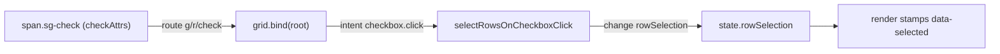

# signal-grid 0.1.0 → Instant Boop recipient grid

Source: `/Users/chrishafley/projects/hafley-rxjs/packages/signal-grid` @ HEAD `d2a6523`.
Scope: read-only. Nothing built, installed, published, committed.

## TOC

1. Verdict
2. Entrypoints and peer dependencies
3. Row / column / cell model
4. Stable identity
5. Selection cell (interactive checkbox)
6. Sort, sizing, scrolling, virtualization
7. Reactive updates
8. Minimal React recipient grid (exact imports)
9. Dependency connection for Instant
10. Required CSS
11. Gaps and risks

## 1. Verdict

The package ships a complete React integration: `<GridView grid={g} />` mounts the DOM renderer
and binds all intents. An interactive checkbox cell is built in (`checkboxColumn()` + the default
Epics), so no custom cell slot is needed and no `.subscribe()` touches the app. `BoopSelectionRow[]`
feeds the grid through `GridConfig.rows` (a `Signal`/`Observable`/function/value), keyed by a stable
`rowId`. Two blockers for Instant are packaging, not API: `@hafley66/signal-grid` and its runtime dep
`@hafley66/trace` are unpublished (public npm and the local verdaccio both 404), and the local
`dist/` has no `.d.ts` though `package.json#types` points at one.

## 2. Entrypoints and peer dependencies

`packages/signal-grid/package.json`

| field | value |
| --- | --- |
| name | `@hafley66/signal-grid` (`:2`) |
| exports `.` | `./dist/index.js` + `./dist/index.d.ts` (`:11-15`) |
| exports `./react` | `./dist/react.js` + `./dist/react.d.ts` (`:12-15`) |
| exports `./theme.css` | `./dist/theme.css` (`:16`) |
| peer (required) | `@hafley66/path >=0.1.0`, `@hafley66/signals >=0.1.0`, `@hafley66/trace >=0.1.0`, `@hafley66/xdom >=0.1.0`, `rxjs ^7.8.0` (`:60-70`) |
| peer (optional) | `react >=18`, `react-dom >=18`, `@logtape/logtape ^2.3.3` (`:71-78`) |

Public barrel `src/index.ts` re-exports every module (`0_types`, `8_grid`, `5_columns`, `7_epics`,
`10_render`, `15_selection`, ...). React surface alone is `src/react/index.tsx`:

| export | line |
| --- | --- |
| `GridView<TRow>({ grid, className, style })` | `src/react/index.tsx:24` |
| `GridViewProps<TRow>` | `:11` |
| `reactSlot<Ctx>(view, options)` | `:64` |
| `ReactSlotOptions` | `:33` |

`GridView` is effect + `render`: `return render(grid, el).stop` (`src/react/index.tsx:27-28`). The
same `grid` instance across re-renders rebuilds no DOM (`react/index.browser.test.tsx` "rebuilds
nothing when the parent re-renders with the same grid"). The `SignalGrid` component under
`examples/0_react.tsx` is a demo alternative renderer, NOT a package export.

## 3. Row / column / cell model

Both axes are `Axis<K, T>` (`src/0_types.ts:56`). Rows and columns are both ordered forests, which
is why tree data and header groups share one code path. `ColumnDef<TRow>` (`src/0_types.ts:257`)
carries `id`, `header`, `field` (typed dotted `SignalPath`), `value`, `width/minWidth/maxWidth`,
`flex`, `sortable`, `resizable`, `pin`, and per-column `cell` / `headerCell` slots. Cells and rows
are replaceable through `Slots<TRow>` (`src/0_types.ts:230`), whose contexts are `CellCtx`
(`:174`) and `RowCtx` (`:200`).

## 4. Stable identity

`RowId = string`, documented "stable across data refresh. Selection, expansion, sizing, and pinning
are keyed by it" (`src/0_types.ts:16`). `GridConfig.rowId: (row) => RowId` is deliberately
non-reactive: "a changing row id is a data reload, not a state change" (`src/8_grid.ts:133-138`).

For Boop rows use a composite of the address fields, not the title:

```ts
rowId: (r) => `${r.route}\u0000${r.session}\u0000${r.pane}`
```

NUL is already the package's cell separator (`CELL_SEP`, `src/0_types.ts:22`), so it cannot appear
in a session/pane id.

## 5. Selection cell (interactive checkbox)

Built-in factory: `checkboxColumn<TRow>(opts)` (`src/5_columns.ts:290`). Properties: id `__check`
(`BUILT_IN_IDS`, `:25`), width/min/max 36 px, default `pin: "start"`, `sortable:false`,
`groupable:false`. Cell content is `span.sg-check` carrying `checkAttrs()`; the header is a live
tri-state `Signal` glyph driven by `selectAllSignal`.

Click path (no app code):



`selectRowsOnCheckboxClick` is installed by `defaultEpics()` (`src/7_epics.ts:227`, `:748-771`), and
`GridView` -> `render()` -> `grid.bind(root)` wires the route automatically (`src/10_render.ts:1085`).

The selection map is `GridState.rowSelection: Readonly<Record<RowId, boolean>>`
(`src/0_types.ts` GridState). `row.selected` from `BoopSelectionRow` is NOT read by the grid; it
would be a second source of truth. Drop it or seed/read it explicitly (section 8).

Do not replace the checkbox column's `cell` slot: the built-in glyph's route is `g/r/check`, and a
cell slot mounted through the cell route reads `g/r/c/check`, matching no template. The package's own
example states this and re-dispatches manually (`examples/12_row_selection.ts` top comment). Keep the
built-in unless you also dispatch `{ phase:"intent", type:"checkbox.click", row, mods }` yourself.

## 6. Sort, sizing, scrolling, virtualization

| concern | mechanism | source |
| --- | --- | --- |
| sort | `state.sort: SortItem[] {field, sort}`; header click epic; per-column `sortComparator` | `0_types.ts` SortItem; `7_epics.ts:128` |
| sizing | `ColumnDef.width/minWidth/maxWidth/flex`; runtime override `state.colWidth`; default 100 | `8_grid.ts:82`, `5_columns.ts` |
| row height | `state.density` compact 28 / standard 36 / comfortable 48; per-row `state.rowHeight` | `8_grid.ts:125`, `:91` |
| virtualization | `state.virtualize { vertical:true, horizontal:false }` default; windowed in `4_slice.ts` | `8_grid.ts:91` |
| scroll | `render()` adds `scroll` + `ResizeObserver`, writes `grid.viewport` and dispatches `viewport.scroll` / `viewport.resize` | `10_render.ts:1064-1086` |
| reconcile | rows keyed by `RowId`, moved not rebuilt; cells rebuild only on data / column run / editing change | `10_render.ts:1-10`, `RowRecord` |

Flex columns are sized by the browser (`grid-template-columns` with `fr`), not in JS; declared width
is the fallback (`8_grid.ts` `widths`). Virtualization needs a non-zero viewport height, so the host
must be a sized box (section 10).

## 7. Reactive updates

`GridConfig.rows` accepts `Signal<T> | Observable<T> | (() => T) | T` (`GridSource`,
`src/8_grid.ts:75`). A grid is created once; to refresh data hand it a `Signal` and write the signal
rather than recreating the grid (recreating loses selection/scroll/identity). State is read/written
through one signal: `g.state.rowSelection.$()` / `g.state.rowSelection.$({...})` (`8_grid.ts` slice).

## 8. Minimal React recipient grid (exact imports)

```tsx
import { useEffect, useMemo } from "react"
import { Signal } from "@hafley66/signals"
import {
  checkboxColumn,
  grid,
  type ColumnDef,
  type Grid,
} from "@hafley66/signal-grid"
import { GridView } from "@hafley66/signal-grid/react"
import "@hafley66/signal-grid/theme.css"

export interface BoopSelectionRow {
  readonly route: string
  readonly session: string
  readonly pane: string
  readonly title: string
  readonly lastFocusedAt: string
  readonly selected: boolean
}

const NUL = String.fromCharCode(0)
export const boopRowId = (r: BoopSelectionRow): string =>
  `${r.route}${NUL}${r.session}${NUL}${r.pane}`

const columns: readonly ColumnDef<BoopSelectionRow>[] = [
  checkboxColumn<BoopSelectionRow>(),
  { id: "title",    header: "Title",    field: "title",    flex: 1, minWidth: 180 },
  { id: "session",  header: "Session",  field: "session",  width: 160 },
  { id: "pane",     header: "Pane",     field: "pane",     width: 100 },
  { id: "route",    header: "Route",    field: "route",    width: 220 },
  {
    id: "lastFocusedAt",
    header: "Last focused",
    field: "lastFocusedAt",
    width: 180,
    // ISO strings: newest first by default; swap for Date.parse if the field is not ISO.
    sortComparator: (a, b) => String(b).localeCompare(String(a)),
  },
]

export function RecipientGrid({
  rows,
  selected,
  onSelectedChange,
}: {
  readonly rows: readonly BoopSelectionRow[]
  readonly selected: ReadonlySet<string>
  readonly onSelectedChange: (next: ReadonlySet<string>) => void
}) {
  const rows$ = useMemo(
    () => Signal<readonly BoopSelectionRow[]>(rows),
    [], // stable Signal; prop changes are pushed in the effect below
  )
  useEffect(() => { rows$(rows) }, [rows, rows$])

  const g: Grid<BoopSelectionRow> = useMemo(
    () =>
      grid<BoopSelectionRow>({
        id: "boop-recipients",
        rows: rows$,
        columns,
        rowId: boopRowId,
        state: {
          rowSelection: Object.fromEntries(
            rows.filter((r) => selected.has(boopRowId(r))).map((r) => [boopRowId(r), true]),
          ),
        },
      }),
    // `rows`/`selected` are intentionally not deps: the grid is created once and fed by signals.
    // eslint-disable-next-line react-hooks/exhaustive-deps
    [],
  )
  useEffect(() => () => g.close(), [g])

  useEffect(() => {
    const read = (): void => {
      const map = g.state.rowSelection.$()
      const next = new Set(
        Object.entries(map).filter(([, on]) => on).map(([id]) => id),
      )
      onSelectedChange(next)
    }
    // Application boundary: this component IS the boundary, one listener, torn down on unmount.
    const sub = g.state.rowSelection.subscribe(read)
    return () => sub.unsubscribe()
  }, [g, onSelectedChange])

  return <GridView grid={g} style={{ blockSize: "100%" }} />
}
```

Notes derived from source, not guessed:

- `rows` must be a `Signal` for refreshes; a new array literal on a re-render does not reach an
  already-constructed grid.
- `selected` is mirrored in via `GridConfig.state.rowSelection` and read back from
  `state.rowSelection`; the per-row `.selected` boolean is ignored by the grid.
- `checkboxColumn()` gives the interactive cell, pinned start, 36 px, tri-state header. No `slots`,
  no `reactSlot`, no manual click handler.
- `GridView` owns all DOM inside its host; pass `className`/`style` for layout only.
- `g.close()` releases the state mirror/url listener; `render`'s teardown is owned by `GridView`.

## 9. Dependency connection for Instant

Measured 2026-09-13:

| package | registry.npmjs.org | local verdaccio 127.0.0.1:4873 |
| --- | --- | --- |
| `@hafley66/signals` | 200 (0.1.1) | 200 |
| `@hafley66/xdom` | 200 (0.1.0) | 200 |
| `@hafley66/path` | 200 (0.1.0) | 200 |
| `@hafley66/signal-grid` | 404 | 404 |
| `@hafley66/trace` | 404 | 404 |

`dist/` currently holds `index.js`, `react.js`, `theme.css`, `10_render-*.js` and no `.d.ts`, while
`package.json#types` points at `./dist/index.d.ts`. `build` is `vite build && cp src/theme.css dist/`
(`package.json:23`); no declaration step exists in the repo scripts. So even a local tarball/link
resolves `types` to a missing file for a TS consumer.

Reproducible options, cleanest first:

1. Publish `@hafley66/trace` then `@hafley66/signal-grid` (with declarations emitted) to the
   registry Instant already uses. Durable; out of scope here (no publish/install).
2. Local workspace integration: vendor the checkout at a relative path inside Instant and commit
   ONLY a relative spec plus a source alias. Relative, so no absolute machine path:
   ```json
   {
     "dependencies": {
       "@hafley66/signal-grid": "file:vendor/hafley-rxjs/packages/signal-grid",
       "@hafley66/trace": "file:vendor/hafley-rxjs/packages/trace"
     }
   }
   ```
   Run `pnpm --filter @hafley66/signal-grid exec tsc -p tsconfig.json --emitDeclarationOnly` (or
   `pnpm prepack`) to add the `.d.ts` files, and add a Vite alias for `@hafley66/signal-grid/react`
   to `.../src/react/index.tsx` plus a `?url`/CSS import for `theme.css` from source if the packaged
   `./theme.css` export is not resolvable.
3. Spike-only: Vite `resolve.alias` straight to `packages/signal-grid/src/index.ts` and
   `src/react/index.tsx`, with `optimizeDeps.exclude` for the package pnpm link. Fastest to try,
   relies on the sibling checkout being present at a relative path.

No absolute path belongs in a committed manifest.

## 10. Required CSS

One import: `import "@hafley66/signal-grid/theme.css"` (export `package.json:16`).

Layout contract (`src/theme.css:1-2` layers, `:70` `[data-route="g"]`, `:100`, `:110-114`):

- The grid root (GridView host child) is `block-size: 100%`; `.sg-scroll` is `overflow:auto` at
  100% x 100%. The host must have a definite height or the viewport measures 0 and virtualized rows
  never render. In a flex/grid parent give the host a resolved height; do not rely on content height.
- All theme rules are scoped under `[data-route="g"]`, which `render()` stamps, so no id selector or
  extra class is needed.
- Checkbox mark is CSS-only: `.sg-check::before` box glyph, swapped by
  `.sg-row[data-selected="true"] .sg-check::before` (`theme.css:469-482`). No markup to supply.
- Palette overrides are `--sg-*` custom properties written unlayered; they win over the layered
  defaults without `!important` (`theme.css:1-2`).

## 11. Gaps and risks

| item | evidence |
| --- | --- |
| signal-grid + trace unpublished | 404 on both registries (section 9) |
| shipped types absent | `dist/` has no `.d.ts`; `package.json#types` points there |
| `BoopSelectionRow.selected` fights `state.rowSelection` | grid reads only `state.rowSelection`; pick one source |
| custom checkbox cell breaks the route | `10_render.ts:78-90`; `examples/12_row_selection.ts` |
| host height pitfall | `theme.css:100,110-114`; viewport fed only by `render()`'s ResizeObserver |
| `@logtape/logtape` optional peer | only needed if `LOG.on` is used; omit otherwise |

## 12. fix-boop-grid-ui answers (src/1_boopSelection.tsx)

### 12.1 Import path and published version

```ts
import { grid, checkboxColumn, type ColumnDef, type Grid } from "@hafley66/signal-grid"
import { GridView } from "@hafley66/signal-grid/react"
import "@hafley66/signal-grid/theme.css"
```

Package `@hafley66/signal-grid@0.1.0` (`package.json:2-3`). NOT published: 404 on
`registry.npmjs.org` and on the local verdaccio `127.0.0.1:4873` (section 9). `pnpm add` cannot
fetch it today. `@hafley66/trace`, its runtime dep, is also 404. `@hafley66/signals@0.1.1`,
`@hafley66/xdom@0.1.0`, `@hafley66/path@0.1.0` ARE installable. Use section 9 option 2 or 3 for
Instant until signal-grid and trace are published.

### 12.2 Component / column-def / row-model shape

`GridView` is the whole React component (`src/react/index.tsx:11-31`):

```ts
{ grid: Grid<TRow>; className?: string; style?: CSSProperties }
```

It renders one `<div ref={host} className={className} style={style}>` and mounts `render(grid, el)`
in an effect. All row/header/cell DOM is created by the package inside that div.

Column-def (`src/0_types.ts:257`), the three fields the lane asked about:

```ts
const COLUMNS: readonly ColumnDef<BoopSelectionRow>[] = [
  { id: "session", header: "Session", field: "session", width: 160, resizable: true },
  { id: "route",   header: "Route",   field: "route",   width: 240, resizable: true },
  { id: "title",   header: "Title",   field: "title",   flex: 1, minWidth: 180 },
]
```

`field` is a typed dotted `SignalPath<TRow>`; `value: (row) => V` is the unchecked escape hatch; both
at once is a construction error (`0_types.ts:288-296`). `id` is required and is the state key.

Row-model: rows are values of `TRow[]`, not a framework row object. The grid derives `Axis<RowId,
TRow>` from `rows` + `rowId` (`8_grid.ts` `base`). Selection and expansion are side maps keyed by
`RowId`, never stored on the row. `BoopSelectionRow` itself is fine as-is; the grid only needs
`rowId`.

### 12.3 Sort / search / keyboard / virtualization

| capability | status | how |
| --- | --- | --- |
| sort | built in | header click epic `sortOnHeaderClick` (`7_epics.ts:128`); state `state.sort: {field,sort}[]`; per-column `sortable` + `sortComparator` |
| multi-sort | built in | model is an array; header click with the chord extends it |
| search / filter | NOT built | `GridState` has no filter key and `filterAxis` has no call site (`README` "What is not built"). Filter rows app-side before the `Signal<readonly TRow[]>` you hand the grid, or map a `Signal`; do not wait for a filter API |
| keyboard | built in | `keyboardNav` in `defaultEpics` (`7_epics.ts:549`): ArrowDown/Up move focus, ArrowRight/Lelft open/close a tree parent or move to it, Space toggles `rowSelection`, Enter emits `activate` effect. Roving tabindex lived in `10_render.ts` |
| virtualization | built in, on by default | `state.virtualize.vertical:true`; `render()` owns the scroll + `ResizeObserver` and feeds `viewport` (`10_render.ts:1064-1086`). Trigger infinite paging via `state.page.mode:"infinite"` |

No built-in text search. For a Boop filter box, derive a filtered array and write it to the rows
`Signal`; selection persists because it is keyed by `RowId`.

### 12.4 Controlled resize / layout hooks

There is no imperative width API and no "onLayout" callback; the package deliberately delegates
track sizing to the browser (`grid-template-columns`, `fr` for `flex`).

- Resize handle renders only when `def.resizable === true` (`10_render.ts:390`); drag is handled by
  `resizeOnHeaderDrag` (in `defaultEpics`) which writes `state.colWidth` on lift
  (`7_epics.ts:311-360`).
- Programmatic: write `g.state.colWidth.$({ ...g.state.colWidth.$(), route: 300 })`.
- Read back: `g.state.colWidth.$()`. `g.view.widths` reports DECLARED width, not painted; a flex
  column has no real number there. Measure the DOM if you need the painted width.
- Layout host: no hook. Give the GridView host a resolved height (section 10) and let CSS size the
  rest.

### 12.5 Three columns with a sizing box

```tsx
export function BoopGrid({ rows }: { readonly rows: readonly BoopSelectionRow[] }) {
  const rows$ = useMemo(() => Signal<readonly BoopSelectionRow[]>(rows), [])
  useEffect(() => { rows$(rows) }, [rows, rows$])

  const g = useMemo(() => grid<BoopSelectionRow>({
    id: "boop-selection",
    rows: rows$,
    rowId: (r) => `${r.route}\u0000${r.session}\u0000${r.pane}`,
    columns: [
      checkboxColumn<BoopSelectionRow>(),
      { id: "session", header: "Session", field: "session", width: 160, resizable: true },
      { id: "route",   header: "Route",   field: "route",   width: 240, resizable: true },
      { id: "title",   header: "Title",   field: "title",   flex: 1, minWidth: 180 },
    ],
    state: { virtualize: { vertical: true, horizontal: false } },
  }), [])

  useEffect(() => () => g.close(), [g])

  return (
    <div style={{ blockSize: 420, minBlockSize: 200, resize: "vertical", overflow: "hidden" }}>
      <GridView grid={g} style={{ blockSize: "100%" }} />
    </div>
  )
}
```

Sizing box points: the outer `div` owns a definite height (px, `clamp()`, or a flex-basis from the
parent). CSS `resize: vertical` gives the user a drag-to-size handle and costs nothing; the grid's
own `ResizeObserver` re-measures and re-windows. Do not let the outer box size to content: a
content-sized box gives the grid zero height and no rows render.

### 12.6 React 19 constraints

| item | fact | source |
| --- | --- | --- |
| peer range | `react >=18.0.0`, `react-dom >=18.0.0`, both optional | `package.json:66-77` |
| dev/test | `react@19.2.8`, `react-dom@19.2.8`, `@types/react@19` | `package.json:104-107` |
| StrictMode | double mount handled; `render()`/`bind()` are idempotent teardowns | `react/index.browser.test.tsx` "survives StrictMode's double mount" |
| flushSync | `GridView` uses plain effect + `render`; only `reactSlot` calls `flushSync` | `react/index.tsx:27-28`, `:64-86` |
| JSX-in-cell | only through `reactSlot`; a bare React element in a slot is dropped by the DOM path | `react/index.tsx:38-43` |

No React 19-specific blockers. Do not pass a different `grid` object per render; that detaches and
remounts the DOM.

### 12.7 Published / installable by pnpm?

No. `@hafley66/signal-grid@0.1.0` and `@hafley66/trace@0.1.0` return 404 on both the public registry
and the local verdaccio (section 9), and `dist/` has no `.d.ts`. `pnpm add @hafley66/signal-grid`
will fail. Instant needs either a publish (out of scope, no publish here) or the relative
`file:`/Vite-alias integration in section 9.
## 13. Registry recon + bundling/publish request (fix-boop-grid-ui, m-f180d071)

### 13.1 Corrected registry state (local verdaccio 127.0.0.1:4873)

| package | verdaccio | npm public |
| --- | --- | --- |
| `@hafley66/signals` | 200 (0.1.1) | 200 |
| `@hafley66/xdom` | 200 (0.1.0) | 200 |
| `@hafley66/path` | 200 (0.1.0) | 200 |
| `@hafley66/trace` | 404 | 404 |
| `@hafley66/signal-grid` | 404 | 404 |

`path` IS present (lane's "check" answered: 200). `trace` is `workspace:*`
(`signal-grid/package.json:41`, and a peer at `:62`), `signal-grid/dist/index.js` imports it, and
trace has a built `dist/` with `.d.ts`. So the missing publishables are exactly `trace` then
`signal-grid`.

### 13.2 Types gotcha even after publish

`signal-grid` `vite.config.ts` has no `vite-plugin-dts` (trace's does). So a signal-grid tarball or
publish carries NO `.d.ts`; `package.json#types` points at a file that never gets built. TS consumers
(typecheck, not just runtime) fail regardless of registry. Fix belongs in the library:
add `vite-plugin-dts` to `signal-grid/vite.config.ts` (mirror `trace/vite.config.ts:4,13-15`). That is
a library change and is outside this lane's authorization.

### 13.3 Can this lane publish / hand a tarball?

No. `chore-boop-grid-api` brief forbids modifying the library and forbids install/publish. Publishing
to the local verdaccio is still publishing. This lane can only hand these exact commands to whoever
holds authorization (parent `codex-31`):

```sh
# 1. types fix required first (authorized library edit): add vite-plugin-dts to signal-grid vite.config.ts
# 2. build + publish trace, then signal-grid
pnpm --filter @hafley66/trace build \
  && pnpm --filter @hafley66/trace publish --registry http://127.0.0.1:4873 --no-git-checks
pnpm --filter @hafley66/signal-grid build \
  && pnpm --filter @hafley66/signal-grid publish --registry http://127.0.0.1:4873 --no-git-checks
```

A `pnpm pack` tarball alone is not a fix: `pnpm pack` rewrites `workspace:*` to `0.1.0`, so installing
the signal-grid tarball still fetches `@hafley66/trace@0.1.0` from a registry that 404s. Bundling
trace into signal-grid needs a changed build config (same unauthorized library edit).

### 13.4 No-publish integration that works today (reproducible, no absolute path)

Vendor the checkout at a relative path in Instant (git submodule or subtree), then resolve
signal-grid from SOURCE and trace from its relative package dir. Published peers cover the rest.

Instant `package.json`:

```json
{
  "dependencies": {
    "@hafley66/signals": "^0.1.1",
    "@hafley66/xdom": "^0.1.0",
    "@hafley66/path": "^0.1.0",
    "@hafley66/trace": "file:vendor/hafley-rxjs/packages/trace",
    "rxjs": "^7.8.2"
  }
}
```

Instant `vite.config.ts`:

```ts
import { fileURLToPath } from "node:url"
const sg = (p: string) =>
  fileURLToPath(new URL(`./vendor/hafley-rxjs/packages/signal-grid/${p}`, import.meta.url))
export default {
  resolve: {
    alias: {
      "@hafley66/signal-grid/react": sg("src/react/index.tsx"),
      "@hafley66/signal-grid/theme.css": sg("src/theme.css"),
      "@hafley66/signal-grid": sg("src/index.ts"),
    },
  },
}
```

Instant `tsconfig.json` (so TS uses source, not the absent `dist/index.d.ts`):

```json
{
  "compilerOptions": {
    "paths": {
      "@hafley66/signal-grid": ["vendor/hafley-rxjs/packages/signal-grid/src/index.ts"],
      "@hafley66/signal-grid/react": ["vendor/hafley-rxjs/packages/signal-grid/src/react/index.tsx"]
    }
  }
}
```

Then `import "@hafley66/signal-grid/theme.css"` resolves through the alias. Runtime imports
`@hafley66/trace` via the `file:` dep (trace dist + d.ts already built). `@hafley66/signals`, `xdom`,
`path` install from the registry. No absolute machine path is committed; the only local coupling is
the relative `vendor/` path.

### 13.5 Bottom line for the lane

Proceed with the TreeTable stopgap: the user bug (checkbox visibility + resizable dropdown) is
fixable without signal-grid. Migration is blocked on the library shipping types, then publishing
`trace` + `signal-grid`; both need parent authorization.
