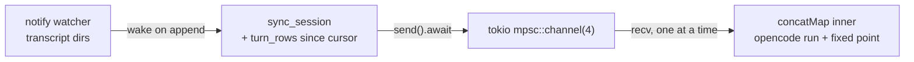

# concatMap rust rewrite — SKETCH (2026-08-14)

Status: sketch, not a plan. v1 is the bash harness on `feature/concat-map`.
Nothing here is committed to. Written to preserve the reactive-glue decisions
from the 2026-08-14 session so the rewrite lane does not re-derive them.

## What exists (verified pub API, hafley-rs `crates/boop`)

| need | API | file |
| --- | --- | --- |
| open store | `boop::open_default() -> Store` | `lib.rs:43` |
| turn query | `Store::turn_rows(&TurnQuery)` -> `Vec<TurnRow>` | `query.rs:280` |
| typed reads | `SessionRow`, `StatusRow`, `UsageRow`, `EdgeRow` | `rows.rs` |
| ingest | `sync_session` / `sync_session_with_pid` | `ident.rs:1219` |
| transcript tail | `tail::read_complete_lines(file, offset)` | `tail.rs` |
| DL6 bind | rows are flat scalars for a fixture column bind | `rows.rs:4` |

No push surface in the crate: no `notify`, no async runtime, no channels.
Reads are pull + cursor. Library is linkable in-process (lib.rs doc says so).

## Target shape

## Glue decisions (settled this session)

| decision | call | reason |
| --- | --- | --- |
| runtime | tokio | notify + opencode spawns are natural there |
| backpressure | bounded `tokio::sync::mpsc(4)` | sender parks when full; disk is the unbounded buffer |
| concatMap op | `.then(rewrite)` on the receiver stream, or plain `while recv()` | sequential by contract; `.then` on a Stream is rxjs concatMap |
| mpmc | none for v2 | one consumer is the point; pool would turn it into mergeMap(n) and lose order |
| shareReplay(1) | `tokio::sync::watch` | when instant poll, terminal, ledger all want the current pair |
| shareReplay(N>1) | hand-rolled VecDeque + broadcast poke | no tokio primitive; only if ever needed |
| crossbeam | skipped | sync-world crate; tokio mpsc covers the async design |
| DL6 | fixture binds to `TurnRow` columns | makes the query contract fixture-tested, not SQL-string-tested |

## Rxjs -> rust operator map

| rxjs | rust |
| --- | --- |
| `concatMap(f)` | `.then(f)` (await each before pulling next) |
| `mergeMap` unbounded | `.map(f).flatten()` |
| `mergeMap(n)` | `.map(f).buffered(n)` |
| `share()` | spawn source task feeding a channel (channels are born hot) |
| `shareReplay(1)` / BehaviorSubject | `tokio::sync::watch` |
| Subject | `tokio::sync::broadcast` (no replay to late joiners) |

## Swap table (bash -> rust)

| bash artifact | rust replacement |
| --- | --- |
| `boop db sync create --forever` process | notify watcher + `sync_session` in-process |
| 5s `boop db` poll + jq | `turn_rows(TurnQuery)` per wake, typed `TurnRow` |
| `state/queue` dir + done-markers + coalesce | `mpsc::channel(4)` |
| `pipe.sh` + `opencode run` | `std::process::Command` or async spawn, same fixed-point diff |

## Open

- home for the binary: `crates/concatmap` in hafley-rs (path-dep on boop) vs
  instant-side host. Lean hafley-rs.
- instant integration later: link the crate in tauri instead of shelling to
  the binary (the lib was authored for this).
- `watch` channel added only when a second reader of the current pair exists.
