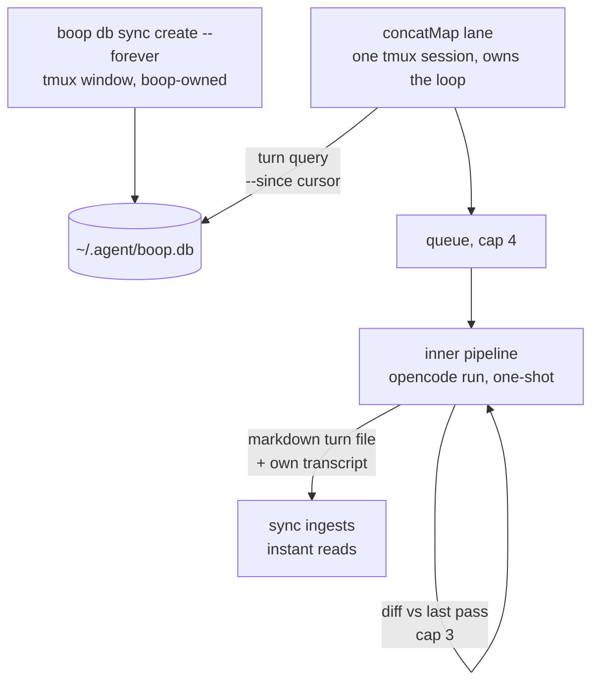

# concatMap: turn-query driven refinement lane

Date: 2026-08-14.

## TOC

1. Goal
2. Semantics
3. Architecture
4. Components
5. Turn query
6. Message contract
7. Inner pipeline
8. Output and ledger
9. Experiments layout
10. Spawn commands
11. Decisions open

## Goal

A resident lane that reads new contact pairs (ai turn + user turn) out of the
boop store and pipes each through a cheap one-shot model pass until the output
is readable: short sentences, tables over prose, no filler. The mapping model
knows nothing about boop, lanes, cursors, or that it is pass N of anything.

## Semantics

concatMap (RxJS): each incoming pair maps to one inner pipeline; the inner
pipeline runs to completion before the next pair starts; order preserved;
excess pairs queue.

```
source     --u1------u2----u3--------->
concatMap  --[==R1==][==R2==][R3]----->
             u2 waits: inner busy
             one at a time, forever
```

Queue cap 4. Pairs older than the newest user turn at drain time coalesce to
just the newest (a rewrite of a stale turn is worthless once you typed again).

## Architecture



No daemon of ours: both resident processes are tmux sessions boop spawned and
instant already polls.

## Components

| component | owner | role |
| --- | --- | --- |
| `boop db sync create --forever` | boop | ingest every harness transcript into the db |
| concatMap lane | `beep lane create` | tmux session running the loop shell |
| turn query | loop | SELECT pairs newer than cursor from `agent_turn` |
| inner pipeline | loop, per experiment | flash4 one-shot + fixed-point check |
| ledger | sync | mapper transcripts + `agent_usage` rows |

## Turn query

Source observable. Reads `agent_turn` joined to `agent_session`.

```sh
boop db --format ndjson "
select s.nickname, u.session_id, u.turn, u.ts,
       u.said as user_text, a.said as ai_text
from agent_turn u
join agent_session s on s.session_id = u.session_id
left join agent_turn a
  on a.session_id = u.session_id
 and a.role_id = 2
 and a.turn = (select max(turn) from agent_turn
               where session_id = u.session_id and role_id = 2
                 and turn < u.turn)
where u.role_id = 1 and u.ts > \$CURSOR
order by u.ts"
```

Facts verified against the live db (2026-08-14):

- `agent_turn(session_id, turn, ts, role_id, said)`, PK `(session_id, turn)`.
- `dict_role`: 1=user, 2=assistant, 3=tool, 4=system, 5=developer. Tool and
  system turns never match the filter.
- `ts` is epoch ms.
- `ai_text` null on a session's first turn: map user turn only.
- Dedupe on `(session_id, turn)`, not ts; a late sync burst can deliver two
  pairs in one tick.

Cursor: max `ts` of pairs processed, held in the loop, monotone. `boop db
sync-cursor list` distinguishes ingest lag from no new turns.

## Message contract

Three fields, nothing else. No boop, no lane names, no pass count.

```
mode: {{mode}}

<ai>
{{ai_text}}
</ai>

<user>
{{user_text}}
</user>
```

Return contract (one line in the mode definition): return only the rewritten
ai turn; code paths and numbers verbatim. The fixed-point check runs in the
shell; the model is never asked to self-assess.

## Inner pipeline

Per contact pair:

```
step 0  render message from template      -> msg.txt
step 1  opencode run -m <model> --message -> pass1.md
step 2  reformat diff pass1 vs pass2      -> changed?
step 3  changed and passes < 3: rerun     -> goto 1
step 4  steady state: last pass wins      -> write out
```

Model default: `openrouter/deepseek/deepseek-v4-flash-0731` (deepinfra pin).
Cap 3 passes: cheap models oscillate past that.

## Output and ledger

- Write `out/<session-short>/<turn>.md` in the lane worktree.
- The mapper's own opencode transcript is ingested by sync, giving per-pass
  session rows in `agent_turn` and cost in `agent_usage`.
- Read surface for v1: instant Agents panel session rows (existing 1.5s poll).
- No new db table: passthrough SQL is read-only, and `agent_edge` is
  session-grain only, so turn-grain pipe state stays in worktree files.

## Experiments layout

```
experiments/
  <name>/
    template.md    # pairing + contract text
    pipe.sh        # passes, model id, fixed-point check
    mode           # one word
```

Shared loop is constant across experiments; template, mode, and pipe.sh vary.

## Spawn commands

```sh
# resident ingest (once, in a throwaway tmux window)
boop db sync create --forever

# the lane
boop beep lane create \
  --lane concat-map \
  --cwd /Users/chrishafley/projects/instant \
  --brief /Users/chrishafley/projects/instant/plans/2026-08-14-concatmap.md \
  --branch lane/concat-map \
  --goal "turn query -> queue -> concatMap inner -> out; ledger via sync"
```

## Decisions open

| decision | options | default |
| --- | --- | --- |
| queue overflow policy | drop oldest, coalesce to newest, block | coalesce to newest |
| pass output comparison | plain diff after normalizing whitespace | plain diff |
| read surface | worktree md files, db favorite, instant panel | instant panel v1 |
| mode set | tighten, table, terse | tighten |
