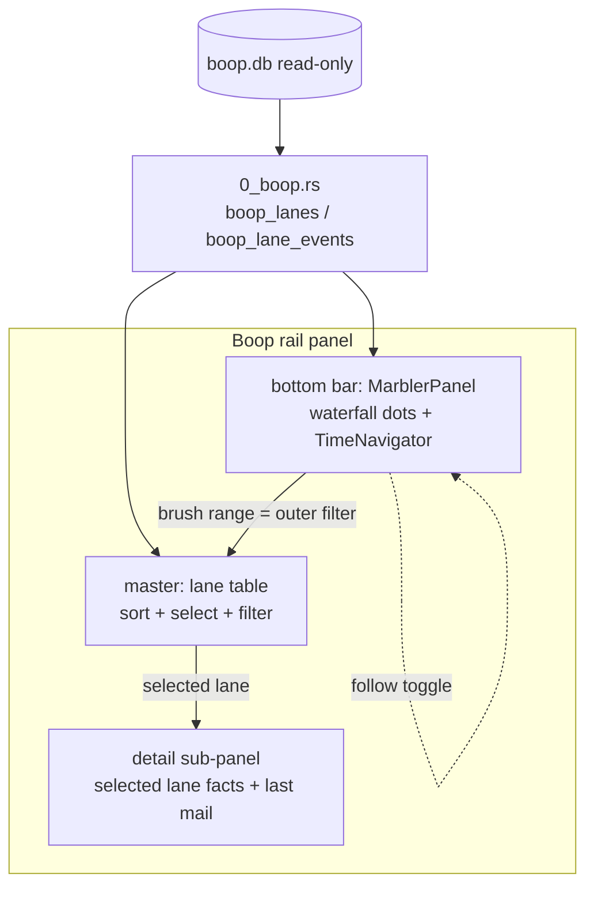

# Boop panel: master lanes + bottom bar marbler (instant is the join)

Date: 2026-09-01. Status: plan, awaiting go.

## TOC

1. Goal and non-goals
2. Pieces already on the table
3. Join surface: type signatures
4. Data mapping: boop rows to marbler lines
5. Phases: one worktree lane each
6. Panel layout
7. Lifetimes and storage
8. Validation per phase

## 1. Goal and non-goals

Goal: an instant rail panel that reads the boop store and renders agent lanes
twice: a master table (lane list, normal table behavior) and a bottom bar
running `@hafley66/marbler` (waterfall dots, time navigator, follow mode).
instant joins boop data to hafley-rxjs views; it owns no rendering of its own.

Non-goals (the last attempt died on these):

- No new marble/grapht demo. marbler is consumed as published, unmodified.
- No keybinding until phase 5. `cmd+shift+.` comes last, one line, after the
  panel earns it.
- No marbler feature work inside instant. If marbler needs a change, that is
  a separate hafley-rxjs lane and instant re-pins the version.

## 2. Pieces already on the table

| piece | where | state |
| --- | --- | --- |
| panel registry | `src/panels.ts` `registerPlugin({panels:[...]})` | rails: tmux, Worktrees, Activity, Favorites, Config, Status |
| table primitive | `src/table.ts` `DataTable`, sort via `SortState` | used by tablepanels.tsx, drag rows, ctx menus |
| panel bridge pattern | `src/tablepanels.tsx` `setActivityPanel(b)` | Tauri bridge injected once at startup, panel reads it |
| boop read bridge | `src-tauri/src/0_boop.rs` (802 lines) | opens store read-only (`open_store_ro`), serves turn sync |
| store tables | `~/.agent/boop.db` | `agent_lane`, `agent_session`, `agent_live`, `agent_live_span`, `agent_mail`, `agent_turn` |
| marble widget | `hafley-rxjs/packages/marbler` `@hafley66/marbler@0.0.2` | grid table + Pixi waterfall + TimeNavigator; TimeViewport already has `followLive`, pan, brush, zoom, fit |
| instant hafley deps | package.json | `@hafley66/grid`, `signals`, `json-rx`, `md` pinned; marbler missing |

## 3. Join surface: type signatures

```ts
// src/boopPanel.tsx (new file, phase 1)
export function setBoopPanel(b: BoopBridge): void        // same shape as setActivityPanel
export function BoopPanelV2(): JSX.Element               // rail panel body

// src-tauri/src/0_boop.rs (extend, read-only)
#[derive(Serialize)]
pub struct BoopLane {
    pub lane: String,          // route name, e.g. "fix-diagram-flicker-diag"
    pub harness: String,
    pub model: String,
    pub goal: String,
    pub branch: Option<String>,
    pub cwd: Option<String>,
    pub spawned_ts: i64,
    pub state: String,         // "open" | "closed"  (agent_live status + live span to_ts)
    pub session: Option<String>,
}
#[derive(Serialize)]
pub struct BoopLaneEvent {
    pub lane: String,
    pub ts: i64,
    pub kind: String,          // "mail-in" | "mail-out" | "state" | "turn"
    pub peer: Option<String>,  // to_route / from_route
    pub preview: String,       // body head, one line
}
#[tauri::command]
pub fn boop_lanes() -> Result<Vec<BoopLane>, String>;
#[tauri::command]
pub fn boop_lane_events(since_ms: i64) -> Result<Vec<BoopLaneEvent>, String>;
```

```ts
// the marbler join (phase 2), marbler source unchanged
const model = createMarbler(seed);      // @hafley66/marbler
model.source.$(toEvents(lanes, events)) // push refresh
model.filter.$("all")                   // disabled = filtered line, data unchanged
model.viewport gestures                  // follow / brush / pan / zoom / fit, built in
```

Pseudo-code, refresh cycle:

```
on show:        fetch lanes + events(since=now-24h) -> build rows -> paint
every 1s:       fetch lanes + events(since=lastTs) -> merge -> source.$(rows)
on hide:        stop interval
selection:      master row click -> detail sub-panel (lane facts + last mail)
navigator:      brush range -> outer filter on master table rows by spawned_ts/last ts
follow mode:    viewport.followLive -> autoscroll marbler; off -> free pan
```

## 4. Data mapping: boop rows to marbler lines

Semantics fixed by the user: a lane is a line; each next event is a dot;
states are yields; a line is open, closed, or disabled (filtered).

| boop source | marbler target | note |
| --- | --- | --- |
| one `agent_lane` (+ `agent_session`, `agent_live.status`) | one `MarbleEvent` row | `from`/`to` = route names, `name` = lane |
| `agent_live.status` + `agent_live_span` `from_ts`/`to_ts` | `phases[]` | state = yield; open line = span with null `to_ts` |
| `agent_mail` row | `frames[]` (`mail-in`/`mail-out`, `t`, `peer`, `preview`) | dot on the line |
| `agent_turn` | `frames[]` kind `turn` (phase 3) | dot |
| marbler `filter` signal | disabled line | presentation state only, never deleted data |

## 5. Phases: one worktree lane each

Each lane: flash4 unless noted, disjoint file ownership, `just check` +
`just test` green before done. Base for lane 1 is current main
(01b70a9); each later lane rebases on the merged previous phase.

| # | lane | owns | done when |
| --- | --- | --- | --- |
| 1 | `feature/boop-panel-master` | `src/boopPanel.tsx`, `src/panels.ts` (register only), `0_boop.rs` (two commands + structs), `src/main.ts` (bridge wire) | rail panel "Boop": master lane table, sortable, click selects, detail sub-panel shows lane facts; no marbler |
| 2 | `feature/boop-panel-marbler` | `src/boopPanel.tsx` (bottom half), `package.json` (add `@hafley66/marbler`) | bottom bar renders events as dots + state phases from real store rows |
| 3 | `feature/boop-panel-time` | `src/boopPanel.tsx` (wiring only) | follow toggle chases `now`; navigator brush pans and acts as outer filter on the master table; fit on double click |
| 4 | `feature/boop-panel-table` | `src/boopPanel.tsx` | column sort persisted, row ctx menu (open lane pane via `boop beep lane pane`), filter text box |
| 5 | `feature/boop-panel-keybind` | `src/keymap.ts` command entry + panels toggle | `cmd+shift+.` toggles the panel; palette entry "Boop panel" |

Phase 1 is the whole "dead simple start": if it ships and feels right, the
rest follows; if not, nothing below it is wasted (the Rust commands and
master table stand alone).

## 6. Panel layout



One focus per region: master answers "what lanes exist", bottom answers
"when did they emit", detail answers "what did this one say".

## 7. Lifetimes and storage

| object | lifetime | owner |
| --- | --- | --- |
| `BoopBridge` handle | app process, set once in `main.ts` | module singleton, mirrors Activity bridge |
| marbler `model` | panel mount | React effect creates, disposes on unmount |
| poll interval | panel visible | start on dockview visibility, stop on hide |
| render cache | model `source` signal | marbler internal |
| store handle | per command call | `open_store_ro`, opened and dropped per query, no writes |
| lastTs cursor | panel instance | module state, reset on show |

Reads and writes, ordered: panel show -> `boop_lanes()` + first
`boop_lane_events(since = now - 24h)` -> merge into rows -> paint; tick ->
`boop_lane_events(since = lastTs)` -> append -> `source.$()`; uniqueness =
`message_id` on mail events, `(session_id, from_ts)` on live spans.

## 8. Validation per phase

| phase | command | must show |
| --- | --- | --- |
| all | `just check` | tsc clean |
| all | `just test` | vitest green |
| 1 | manual: open Boop rail | lane list matches `boop db lanes` |
| 2 | manual + vitest case for the row mapper | dots line up with `boop db mail` timestamps |
| 3 | manual: toggle follow, let a lane emit | viewport chases; brush filters master |
| 4 | manual | sort persists across panel close/open |
| 5 | manual | `cmd+shift+.` toggles; typing in terminal unaffected |
