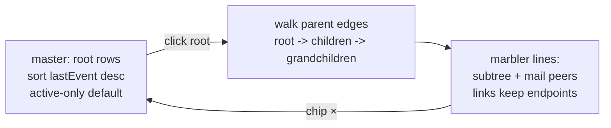

# Boop panel: root sessions, active-only default, last-update sort

Date: 2026-09-01. Branch: feature/boop-panel (2c668ae). Status: plan, awaiting
approval. Purpose stated by the user: reviewing messages sent and subagent
relationships over time, from the main TUI sessions down.

## TOC

1. Changes
2. Root and active semantics
3. Click behavior: subtree narrowing
4. What stays out
5. Tests and validation

## 1. Changes

| # | change | side | files |
| --- | --- | --- | --- |
| 1 | default sort = last event, newest first | TS | `src/boopPanel.tsx` (`BOOP_SORT` -> `[{ id: "lastEvent", desc: true }]`) |
| 2 | "active only" checkbox, default on, persisted | TS | `boopPanel.tsx` toolbar + `src/0_settings.ts` one `setting()` line + `state.ts` type |
| 3 | master table lists root sessions only | TS | `boopPanel.tsx`: `rootLanes(lanes)` filter; Rust unchanged, the full lane list still ships for descendant walks |
| 4 | click a root narrows marbler to its descendant subtree + mail peers | TS | `boopPanel.tsx`: `subtreeLanes(lanes, root)` replaces `narrowRows` peer-only rule; chip reads `root + N descendants` |
| 5 | empty state when active-only hides everything | TS | one hint line under the checkbox: "N hidden by active-only" with the count |

No Rust changes: `boop_lanes` already returns parent + tmux-derived state for
every lane, which is exactly what the root filter and subtree walk need.

## 2. Root and active semantics

| term | rule | measured now |
| --- | --- | --- |
| root session | `parent IS NULL` or `parent = 'root'`; covers kind `coordinator` (97, all parent-null: the TUI panes like claude-275), `native`, and top-level `lane` (16 + 2) | ~115 root rows |
| active | tmux session exists (state already computed at 2c668ae; fallback: pid-bearing live row) | live tmux now: 4 sessions, no lane/coordinator panes of ours |
| active-only default | checkbox ON at first launch, persisted per settings key `boopOnlyActive` | default view: the handful of live root sessions |

The 97 coordinator routes are mostly stale panes; active-only is what keeps
the root list reviewable, which is why it defaults on.

## 3. Click behavior: subtree narrowing

`subtreeLanes(lanes, root)`: BFS over `lane.parent` starting at the clicked
root; union with mail peers of every subtree lane (existing peer rule) so
cross-tree links still draw. Lines outside the set are the disabled/filtered
state. Clicking the root again or the chip clears. The drawer still opens on
the clicked root; intermediate lanes are readable in the marbler grid rows,
never required as clicks.

## 4. What stays out

- No marbler tree nesting (`children` rows) this pass: flat subtree lines
  already show who talked to whom; nesting is cosmetic and can follow.
- No change to event sources (mail dots only; live-span phase yields stay a
  follow-up).
- No keybinding work.

## 5. Tests and validation

| unit under test | case |
| --- | --- |
| `rootLanes` | parent null and 'root' pass; named parent (claude-5) filtered |
| `subtreeLanes` | two-level chain root -> child -> grandchild all kept; sibling subtree dropped; mail peer outside tree kept |
| sort default | `BOOP_SORT` is lastEvent desc |
| active-only | filter keeps `state === 'open'` only |

Validation: `tsc --noEmit`, `vitest run`, `vite build`, then manual in the
running dev session: default view = active roots sorted by last event; click
a root -> subtree lines + links; uncheck -> all roots.
