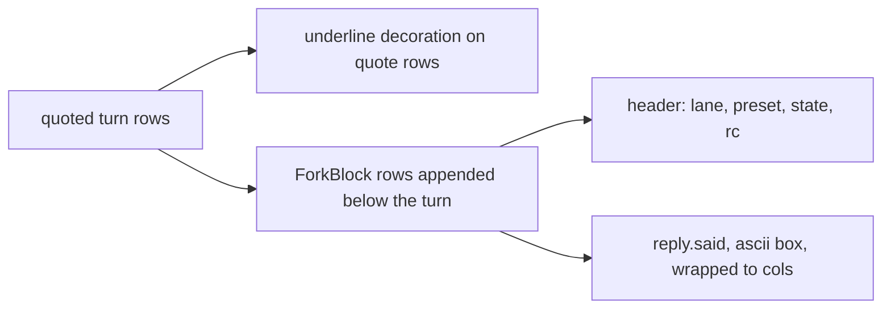
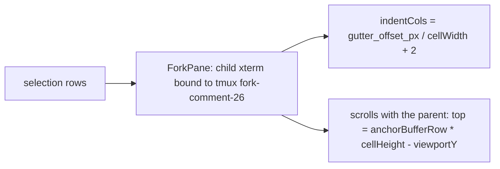

# Comment fork rendering (horizontal and vertical)

1. What exists
2. Type signatures
3. Storage and reads
4. Horizontal fork: lane reply under the quoted turn
5. Vertical fork: child session indented under the selection
6. Sequence
7. Open calls

## 1. What exists

| piece | where | state |
|---|---|---|
| `boop beep fork <comment-id> --preset p` | hafley-rs `crates/boop/src/cli/job.rs` `run_fork` | landed a908e56 |
| `agent_turn_comment_fork(comment_id, lane, branch, brief, created_ts)` | hafley-rs `crates/boop-store/src/ident.rs`, schema v25 | landed |
| `agent_turn_comment_reply` view (comment -> reply turn) | schema v24 | landed |
| annotation marks on quoted turns | `src/1d_terminalTurnMarks.ts` `PlacedAnnotation`, `placeAnnotations` | landed 72cbaf8 |
| gutter checkbox painter | `src/1a2_terminalContextGutter.ts` `TerminalContextGutter` | dev 3a72941 |
| tauri read of comments | `src-tauri/src/0_boop.rs` `boop_turn_annotations(sessions)` | landed |

## 2. Type signatures

```ts
// src-tauri: one more read, same shape as boop_turn_annotations
// boop_turn_comment_forks(comment_ids: number[]) -> BoopTurnCommentFork[]
export type BoopTurnCommentFork = {
  comment_id: number;
  lane: string;          // "fork-comment-26"
  branch: string;        // "fork/comment-26"
  brief: string;         // path the lane read
  created_ts: number;
  // joined in the same read: the lane's result row and its last assistant turn
  state: "running" | "done" | "dead";
  rc: number | null;
  reply: { session: string; turn: number; said: string } | null;
};

// src/1e_terminalForkMarks.ts
export type PlacedFork = PlacedAnnotation & { fork: BoopTurnCommentFork };
// pseudo: for each placed annotation whose comment has forks, one PlacedFork per fork;
//         bufferRow = the annotation's mark row (markRowFor)
export function placeForks(placed: PlacedAnnotation[], forks: BoopTurnCommentFork[]): PlacedFork[];

// horizontal: rows appended under the quoted turn, in the buffer, not the DOM
export type ForkBlock = { afterBufferRow: number; lines: string[] };
// pseudo: header line "└ fork-comment-26 (flash4) done rc=0", then reply.said wrapped to cols,
//         ascii-boxed; underline the quote rows via a decoration
export function forkBlock(fork: PlacedFork, cols: number): ForkBlock;

// vertical: a child pane bound to the lane's tmux session, indented under the selection
export type ForkPane = { lane: string; tmux: string; anchorBufferRow: number; indentCols: number };
export function forkPaneFor(fork: PlacedFork, indentCols: number): ForkPane;
```

## 3. Storage and reads

| read | source | cadence |
|---|---|---|
| comments + reply turn | `boop_turn_annotations` | on turn-visibility change (existing) |
| forks per comment | `boop_turn_comment_forks` (new) | same tick, only for comment ids on screen |
| lane state | `agent_lane` + result row in `agent_mail` (`kind = 'result'`, `from = lane`) | joined inside the tauri read |
| reply text | last assistant `agent_turn` in the lane's session | joined inside the tauri read |

Uniqueness: one `PlacedFork` per `(comment_id, lane)`; the table's primary key already holds that.

## 4. Horizontal fork



Rows are written into the xterm buffer under the turn through the same path the diagram overlay uses (`0_terminalDiagrams.ts`), so `0_terminalRowGeometry.ts` keeps hit-testing by buffer row. A running lane shows the header only; the block grows when `reply` arrives.

## 5. Vertical fork



The child pane is a second `TerminalPanel` instance bound to the lane's tmux session (`tmux: "fork-comment-26"` from the dry-run output), positioned absolutely inside the parent's scroll container. Same binding rule as ff9ff16: bind to that session, never the newest same-cwd one.

## 6. Sequence

```mermaid
sequenceDiagram
  participant U as user
  participant T as terminal (instant)
  participant B as boop
  participant L as lane fork-comment-26
  U->>T: fork on comment 26 (context menu / gutter)
  T->>B: boop beep fork 26 --preset flash4
  B->>B: brief ~/.agent/mail/forks/comment-26.md, row in agent_turn_comment_fork
  B->>L: lane create fork/comment-26
  T->>B: boop_turn_comment_forks([26]) each tick
  L-->>B: result row rc=0, assistant turns ingested
  B-->>T: state done, reply.said
  T->>T: horizontal: ForkBlock under turn 3080; vertical: ForkPane bound to tmux fork-comment-26
```

## 7. Open calls

| call | options |
|---|---|
| which fork shape is default | horizontal (reply text inline) or vertical (live pane) |
| who runs the verb | instant shells out to `boop beep fork`, or the tauri side calls the store and spawns |
| reply source | last assistant turn of the lane session, or the lane's result row body only |
