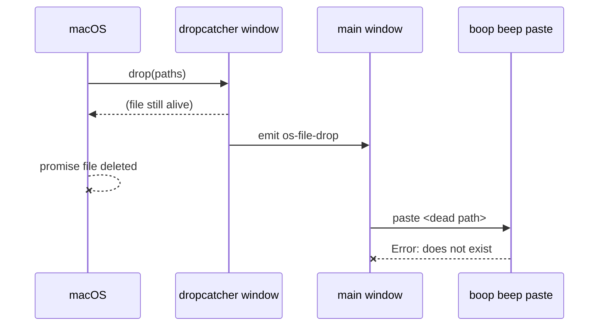
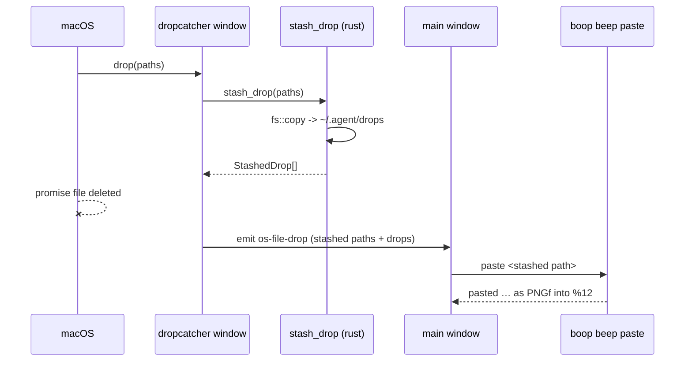

# drop: stash a dropped image before macOS deletes it

Branch `fix/drop-stash` (repo instant, worktree `instant-worktrees/drop-stash`).

## Contents

1. [The defect](#the-defect)
2. [Trace: before](#trace-before)
3. [Trace: after](#trace-after)
4. [What ships](#what-ships)
5. [Stash rules](#stash-rules)
6. [Which window sees the drop](#which-window-sees-the-drop)
7. [Codex panes](#codex-panes)
8. [Gates](#gates)

## The defect

Dragging the macOS screenshot thumbnail into a terminal pane typed a dead path:

```
/var/folders/.../T/TemporaryItems/NSIRD_screencaptureui_1fMIW1/Screenshot 2026-09-05 at 11.40.58 PM.png
```

macOS hands a drag a *promise* file for anything it generated on the fly
(screenshot thumbnail, Photos export, Mail attachment) and deletes it the moment
the drop completes. Every hop after the drop is a race the file loses.

## Trace: before

| # | Step | State of the file |
| - | ---- | ----------------- |
| 1 | `dropcatcher.ts` `onDragDropEvent` fires with `paths` | alive |
| 2 | `await emit("os-file-drop", {paths})` crosses windows | macOS deletes it here |
| 3 | `dnd.ts` listener filters by `IMAGE_EXT` regex (png/jpe?g/gif/tiff?/bmp) | gone |
| 4 | `await clickRpc.runClick("boop beep paste …")` | boop: `Error: … does not exist`, exit 1 |
| 5 | `run_click` returns stdout only, so the `catch` never fires; nothing is typed by us, boop typed nothing either | user sees the path text from the failed round trip |



## Trace: after

| # | Step | State of the file |
| - | ---- | ----------------- |
| 1 | `dropcatcher.ts` `onDragDropEvent` fires with `paths` | alive |
| 2 | `await invoke("stash_drop", {paths})` copies each image to `~/.agent/drops/<YYYYMMDD-HHMMSS>-<name>` | copied while alive |
| 3 | `emit("os-file-drop", {paths: stashed, drops})` | original may vanish; the copy does not |
| 4 | `dnd.ts` filters by `IMAGE_EXTS` (core.ts, now + tif/tiff/heic) and pastes the **stashed** path | copy on disk |
| 5 | `boop beep paste … 2>&1`: `pasted …` / `typed …` = delivered; anything else types the stashed path and toasts the reason. One `instant.log` line per drop | copy on disk |



## What ships

| File | Change |
| ---- | ------ |
| `src-tauri/src/fs.rs` | `stash_drop(paths) -> Vec<StashedDrop>`, `stash_one`, magic-byte table, `~/.agent/drops` naming, 2 s dedupe, `mime_for` gains tiff/heic, `#[cfg(test)] mod tests` (7 tests) |
| `src-tauri/src/lib.rs` | `fs::stash_drop` in `invoke_handler` |
| `ipc/commands.json` | `"stash_drop"` in the `files` group |
| `src/generated/native.ts` | regenerated by `node scripts/generate-native.mjs` |
| `src/0_dropStash.ts` | new: `StashedDrop`, `dropPath`, `pathExt`, `isImagePath`, `pasteFailure`, `dropLogLine`, `unstashed`. No DOM/tauri/core imports, so the catcher bundle stays small |
| `src/dropcatcher.ts` | stashes before `emit`; emits stashed paths plus the `drops` array |
| `src/dnd.ts` | `IMAGE_EXTS` instead of the local regex, pastes the stashed path, `2>&1` + `pasteFailure` for a real failure signal, `flashStatus` toast, `logLine` per drop |
| `src/core.ts` | `IMAGE_EXTS` gains `tif`, `tiff`, `heic` |
| `src/0_dropStash.test.ts` | new: 8 vitest cases over `dropIntoTerminal` and the helpers |

`run_click` reports neither stderr nor exit status (it returns stdout and `Ok`),
which is why the old `try/catch` around the paste could never fire. The call site
now redirects `2>&1` and reads boop's one line: `pasted …` or `typed …` means
delivered, anything else is the failure text shown in the toast.

## Stash rules

| Case | Result |
| ---- | ------ |
| image by extension (`IMAGE_EXTS` + tif/tiff/heic) | copied |
| image by magic bytes, wrong or missing extension | copied (png, jpeg, gif, webp, bmp, tiff LE/BE, heic/heif/avif `ftyp` brands) |
| not an image | untouched, `stashed: null`, `reason: "not an image"` |
| image over 200 MB | untouched, reason names the byte count and the limit |
| name already taken | `-2`, `-3`, … inserted **before** the extension, because boop picks the pasteboard class from the extension |
| same source path twice within 2 s | same stashed path, one copy |

Destination: `~/.agent/drops/20260905-234058-Screenshot-2026-09-05-at-11.40.58-PM.png`
(local time, basename sanitized to `[A-Za-z0-9._-]`, runs of other characters collapsed to one dash).

## Which window sees the drop

The catcher, and only the catcher. `src-tauri/tauri.conf.json` gives `main`
`dragDropEnabled: false` (so dockview tab-drag keeps working) and `dropcatcher`
`dragDropEnabled: true`. The main window's DOM `dragenter` fires first in wall
time but carries no paths; it only raises the catcher. So the stash sits in the
one place the paths exist, and the main window never invokes `stash_drop`.

The 2 s dedupe in `RECENT_STASH` is belt-and-braces: were a second surface ever
given the native handler, the same source path inside the window returns the
same copy instead of a second one.

## Codex panes

Read from `hafley-rs`:

| Harness | `image_paste_keys` | Effect of `boop beep paste` |
| ------- | ------------------ | --------------------------- |
| claude (`harness/claude.rs:26`) | `Some("C-v")` | pasteboard + Ctrl+V |
| codex (`harness/codex.rs:27`) | `Some("C-v")` | pasteboard + Ctrl+V |
| opencode, kimi | `None` | quoted path typed |

`pasteboard_class` (`boop/src/cli/paste.rs:29`) covers png, jpg/jpeg, gif,
tif/tiff, bmp. webp, heic, svg, ico and avif have no class and are typed as a
path even into claude or codex.

The race was never harness-specific: it lives in instant's
catcher → emit → listener → `runClick` chain, which is the same code for every
pane. A codex drop that worked was a drag of a *real* Finder file, whose path
persists; the same screenshot-thumbnail drag into a codex pane would have failed
the same way. The stash fixes both, and it is what makes the typed-path fallback
(webp/heic into codex) resolve to a file that still exists.

## Gates

```
$ cd src-tauri && CARGO_TARGET_DIR=$HOME/.cache/cargo-target/instant-harness-out cargo test
running 76 tests
test result: ok. 76 passed; 0 failed; 1 ignored; 0 measured; 0 filtered out; finished in 4.21s

$ npx vitest run
 Test Files  94 passed (94)
      Tests  559 passed (559)

$ npx tsc --noEmit
TSC_EXIT=0

$ node scripts/generate-api.mjs --check && node scripts/generate-native.mjs --check
API_CHECK_OK
```

clippy not gated (pre-existing errors in this repo).
