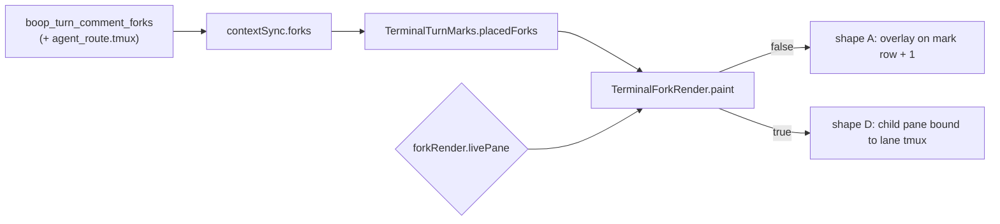
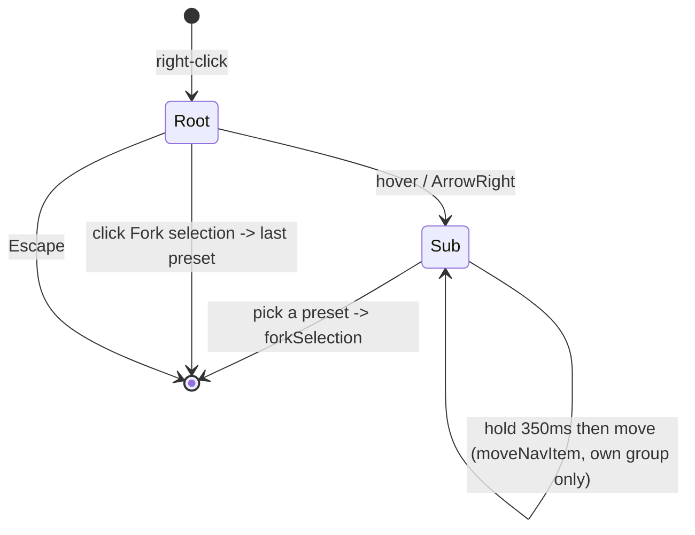

# Comment fork rendering: both shapes, one boolean

1. What shipped
2. The switch
3. Shape A: overlay
4. Shape D: child pane
5. Trigger: right-click the gutter mark
6. The menu behind the trigger
7. Files and commits
8. Validation
9. What is left

## 1. What shipped

A fork placed on a commented turn now draws, in either of two shapes, off the
same `PlacedFork` rows the gutter marks are placed on, repainted on the same
`queue.gutterPaint` tick.



## 2. The switch

| item | value |
|---|---|
| setting | `forkRender.livePane`, `src/0_forkRenderSettings.ts` |
| default | `false` = overlay |
| storage | `setting<boolean>` in `0_persistedSetting.ts`, localStorage key `forkRender.livePane`, same declaration shape as `turnDebug.on` |
| exposure | command palette `view.forkLivePane`, "Toggle Comment Fork Live Pane (overlay ⇄ child pane)", View group |
| repaint | the signal subscription schedules a gutter paint, so flipping it swaps shapes on the next frame with no reload |

No toolbar button: `index.html` carries a fixed set of chrome buttons and the
palette entry is the surface every other terminal-overlay boolean also has.

## 3. Shape A: overlay

| behaviour | where |
|---|---|
| one element per `(commentId, lane)` | `forkKey`, `TerminalForkRender.nodeFor` |
| anchored on mark row + 1, spanning gutter to right edge | `placeForkOverlays` |
| collapsed header `▸ <lane>  flash4  <state> rc=<rc>  <age>` | `forkHeaderText` |
| click toggles; expanded header reads `▾` | header button, `node.expanded` |
| expanded body = reply wrapped to `term.cols`, then branch + brief | `forkBodyLines` |
| running lane = header plus the brief line, reply appears when it lands | `forkBodyLines` returns the branch line alone with `reply: null` |
| covers the rows below | absolute box, `z-index: 3`, opaque `--panel-bg`; rows below never move |
| off-screen row hides the element | `rowOnScreen` per paint |

Age formats: `12s`, `1m12s`, `2h04m`. A fork row whose `created_ts` is in
seconds rather than milliseconds is scaled before the subtraction.

## 4. Shape D: child pane

Shipped as the fallback the brief allows: **spacer plus a static child that
mirrors `tmux capture-pane -p`**, not a live second xterm.

| behaviour | where |
|---|---|
| bound to the fork lane's own tmux session | `BoopTurnCommentFork.tmux`, joined from `agent_route.tmux` in `read_turn_comment_forks`, resolved by `fork_pane_target` (falls back to the lane name, never `""`) |
| screen mirrored every 1.2 s while on screen | `TerminalForkRender.refresh` -> `boop_mux_capture(target, socket: null)` |
| indented into the grid by `fork_indent_px = 26` | `placeForkPanes` |
| fixed height `fork_pane_rows = 8` rows | `placeForkPanes` |
| stacking | each pane starts at its own row or at the bottom of the pane above it, whichever is lower; the absorbed gap is the placement's `spacer` |
| title line `tmux <target> · flash4 · <state>` | `paint` |

Why no live xterm and no row displacement, stated plainly:

- instant's `TerminalPanel` is a dockview panel with a pty of its own
  (`src/reactdock.tsx:225`); nesting one inside another pane's overlay layer
  means a second `open_session` per fork, its own fit/resize loop and its own
  focus routing. That is a lane of its own, not a pass.
- xterm paints its rows from its own buffer. A DOM spacer in the overlay layer
  cannot displace them; the only way to push rows down is writing blank lines
  into the pty, which edits the agent's scrollback. So the pane covers the rows
  under it, exactly as the diagram overlay (`0_terminalDiagrams.ts`) already
  covers its rows, and `0_terminalRowGeometry` hit-testing is untouched and
  therefore still correct: every row keeps the y it always had. The spacer that
  does exist is the pane-vs-pane one above.
- Keystrokes into the lane are consequently not wired. The pane reads.

## 5. Trigger: select text, right-click, pick a preset

The comment is not a step the reader takes. Selecting and right-clicking is.

| step | what the user does | what the code does |
|---|---|---|
| 1 | drag over text in the terminal | xterm's own selection, or the pinned overlay on a pane whose app owns the mouse; `termSelectionText` reads whichever is live |
| 2 | right-click anywhere on that terminal | `ctxItemsFor` adds `Fork selection → flash4 / pro4 / opus` beside "Ask about this" (presets in `FORK_PRESETS`, off `boop config presets`) |
| 3 | pick one | `forkSelection(id, preset)`: snapshot the rows, write the comment (`kind: selection`, no note, client id hashed off the text so re-forking the same range reuses one row), stamp it sent, read back `comment_id`, run `boop beep fork <id> --preset <p>` in the tab cwd |
| 4 | nothing | toast `fork-comment-47 spawned, flash4`; `contextSync.activate()` re-pulls and the fork header paints under the quoted turn |

```mermaid
sequenceDiagram
  participant U as user
  participant C as ctxItemsFor
  participant T as forkSelection
  participant S as boop.db
  participant B as boop beep fork
  U->>C: select text, right-click
  C->>U: Fork selection → flash4 | pro4 | opus
  U->>T: pick flash4
  T->>S: boop_turn_comment_upsert -> comment_id 47
  T->>S: boop_turn_comments_sent
  T->>B: boop beep fork 47 --preset flash4
  B-->>U: toast "fork-comment-47 spawned, flash4"
  T->>S: re-pull; the header paints on the next gutter tick
```

`boop_turn_comment_upsert` used to return `()`; it now returns the row's
`comment_id`, which `boop_store::ident::turn_comment_upsert` was already
handing back and the command was discarding. That is the whole tauri change.

The gutter mark's right-click menu stays as a second way in for a comment that
already exists; it costs nothing and reuses the same `forkCommand`.

## 6. The menu behind the trigger

Research first, per the build-vs-buy law: `plans/2026-09-05-navmenu.BUY-VS-BUILD.md`.

| verdict | call |
|---|---|
| menu + submenu | build `src/0_navMenu.ts` in-repo, adopt native `popover=manual` for the top layer, hand-measure the position. Radix / Base UI / Kobalte are React or Solid at 107 KB to 4.3 MB against 10 imperative call sites; Floating UI (174 KB) only replaces the measure-and-flip `ctxmenu.ts` already had; this engine is Safari 17.6, so CSS anchor positioning is not available to any of them |
| grouped drag reorder | hand-rolled pointer events with a hold timer, reusing `railOrder.mergeOrder`. `@atlaskit/pragmatic-drag-and-drop` (505 KB) is the strongest buy and SortableJS's `delay` is the exact gesture, but both want a list that outlives the gesture and a menu is built per open |

Five steps, and what runs at each:

| # | the user | the code |
|---|---|---|
| 1 open | right-click in a terminal | `wireContextMenu` -> `ctxItemsFor` -> `showContextMenu` -> `openNavMenu`; the root is a `popover=manual` `.ctx-menu` measured and flipped off the window edges. `Fork selection` carries its subtext, the preset `currentForkPreset()` names |
| 2 hover | hover `Fork selection`, or ArrowRight onto it | `openSubmenu` opens a second level at the row's right edge, flipping to its left when it will not fit, and awaits `children()` = `presetGroups(await forkPresets())`: one group per harness, one row per preset, subtext = model (+ `@effort`), DEAD status skipped, the read cached 60 s |
| 3 hold-move | press a preset row (or a harness header) for 350 ms, then move | `wireHoldReorder` arms on the timer, reads the row under the pointer, and applies `moveNavItem` / `moveNavGroup`; a drop on another harness's row returns the order untouched, so an item never leaves its group |
| 4 pick | click a preset, or Enter on it | the menu closes first, then `forkSelection(id, preset)` runs the existing flow: comment row, sent stamp, `boop beep fork <id> --preset <p>`, toast |
| 5 persist | nothing | `fork.lastPreset` takes the preset just run, `fork.presetOrder` holds the order; both are `storageSignal` keys, and the next open reads them back through `orderedGroups` |



### Search, favourites, and the model/render split

The menu is now two exports: `navMenuModel(opts)` holds every visible fact as
signals (query, stack, focus, drag, plus the injected order and favourites) and
derives one `view: SignalOf<NavMenuView>`; `renderNavMenu(view)` is the DOM as a
function of that signal and reads nothing back off an element except an id. It
imports `@hafley66/signals` and `./fuzzy` and nothing else, so it lifts out as a
package; `src/0_navMenuStore.ts` is instant's storage adapter. API and keys:
`docs/navmenu.md`.

| # | the user | the state that moves |
|---|---|---|
| 1 open | right-click, hover `Fork selection` | `stack` gains a level; the view derives its rows through `orderedGroups` then `withFavorites`, and adds a search row because the level offers more than six items |
| 2 type | types "opus" in the search row | `queries[depth]`; `filterGroups` runs `fuzzyFilter` over `"<group>: <item>"` and every group with no match is not drawn. Escape clears the query and leaves the menu open |
| 3 star | clicks the ☆ on `claude: opus`, or presses `f` on it | `favorites` gains `opus`; the next derivation puts a `Favorites` group on top with the title `claude: opus`, and the row stays in `claude` too |
| 4 reorder | holds a pinned row 350 ms, moves it | `drag` arms, `dragOver` rewrites the favourites list itself (pinned ids carry a `fav:` prefix, so they never collide with home ids and never leave the pinned group) |
| 5 reopen | right-clicks again tomorrow | `fork.presets.favorites` and `fork.presets.order` read back through `mergeIds`, ids that no longer exist drop, and the main row's subtext is the first favourite when nothing has been run yet |

`src/ctxmenu.ts` kept `CtxItem` and became the adapter over the new module
rather than staying a second menu implementation: ten call sites already speak
that type, and one of them (the terminal's) needed submenus, so two menu
renderers would have had to agree on the same `.ctx-menu` skin CSS forever.

## 7. Files and commits

| commit | subject |
|---|---|
| 00ce053 | docs: navmenu buy-vs-build |
| e8ebef6 | ui: nav menu search row on fuzzyFilter, favorites group with group-prefixed titles |
| 17c19f2 | ui: reusable nav menu on signals, submenus, hold-to-reorder within groups |
| b588237 | terminal: Fork selection submenu of presets by harness, last-run preset on the main item |
| 73e01f4 | terminal: select text, right-click, Fork selection → preset; the comment is made for you |
| 497d84c | terminal: the comment fork read carries the lane's tmux target |
| 304fcd5 | terminal: both comment fork shapes, switched by forkRender.livePane |
| bfcfb45 | terminal: right-click a gutter mark to fork its comment |

| file | change |
|---|---|
| `src-tauri/src/0_boop.rs` | `tmux` on `BoopTurnCommentFork`, `fork_pane_target`, `boop_turn_comment_upsert` returns `comment_id`, one test |
| `src/1b_terminalContextSync.ts` | `tmux: string` on the wire type |
| `src/0_forkRenderSettings.ts` | new: the boolean |
| `src/1f_terminalForkRender.ts` | new: placement, header/body text, both shapes, capture poll, menu targets |
| `src/1f_terminalForkRender.test.ts` | new: 22 tests |
| `src/1e_terminalForkMarks.ts` | `FORK_PRESET` exported |
| `src/1d_terminalTurnMarks.ts` | optional `onMenu` on the mark |
| `src/terminal.ts` | constructs `TerminalForkRender`, `forkSelection` (select -> comment -> fork), the mark menu, disposal |
| `src/chrome.ts` | the `Fork selection` row in the terminal right-click menu |
| `src/0_navMenu.ts` | new: the reusable menu (submenus, keyboard, hold-to-reorder, persisted order) |
| `src/ctxmenu.ts` | `CtxItem` unchanged, now an adapter over `0_navMenu` |
| `src/1g_forkPresetMenu.ts` | new: `boop config presets` cached, grouped by harness, main-row preset |
| `src/0_navMenuStore.ts` | new: instant's `<key>.order` / `<key>.favorites` adapter |
| `docs/navmenu.md` | new: the module's API, behaviour and persisted keys |
| `src/1b_terminalContextSync.ts` | `sendSelection`: upsert, stamp sent, return the id |
| `src/main.ts` | palette entry |
| `src/styles.css` | `.term-fork*` for both shapes |

## 8. Validation

```
$ cd src-tauri && CARGO_TARGET_DIR=$HOME/.cache/cargo-target/instant-harness-out cargo test
test boop::tests::fork_state_derives_from_result_row_and_liveness ... ok
test boop::tests::fork_pane_target_falls_back_to_the_lane_name ... ok
test result: ok. 69 passed; 0 failed; 1 ignored; 0 measured; 0 filtered out; finished in 4.41s

$ npx vitest run
 Test Files  92 passed (92)
      Tests  545 passed (545)

$ npx tsc --noEmit
tsc exit=0
```

clippy was not run: instant carries 12 pre-existing errors there.

## 9. What is left

| open | why it is open |
|---|---|
| live keystrokes into a fork pane | needs a real second `TerminalPanel` + pty per fork; the capture mirror is read-only |
| rows below a pane do not move | xterm owns its rows; displacing them means writing blank lines into the pty |
| preset choice is fixed at `flash4` | `FORK_PRESET` is a constant; the menu could offer pro4/opus once the fork row carries the preset it ran with |
| the fork row does not store its preset | the header prints `flash4` unconditionally, inherited from `1e_terminalForkMarks.ts` |
| no visual check in the running app | gates are unit-level; the shapes and the menu have not been seen against a live lane |
| no typeahead, no `aria-activedescendant` in the menu | the search row covers finding a row by name; the buy-vs-build doc names Base UI as the revisit if screen-reader-grade menus are ever needed |
| no keyboard reorder | the move is a pointer hold; arrow-key move is the a11y gap the libraries would have covered |
| the rail keeps its own drag gesture | `rail.ts wireDragReorder` predates `0_navMenu`; merging them means reconciling `moveBefore` with `moveWithin` |
