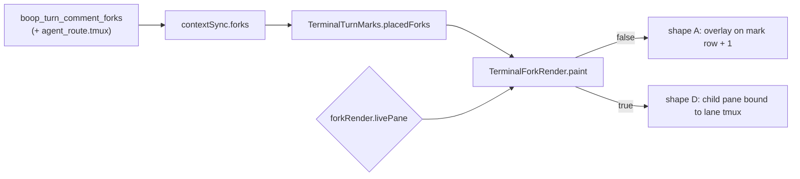

# Comment fork rendering: both shapes, one boolean

1. What shipped
2. The switch
3. Shape A: overlay
4. Shape D: child pane
5. Trigger: right-click the gutter mark
6. Files and commits
7. Validation
8. What is left

## 1. What shipped

A fork placed on a commented turn now draws, in either of two shapes, off the
same `PlacedFork` rows the gutter marks are placed on, repainted on the same
`queue.gutterPaint` tick.



## 2. The switch

| item | value |
|---|---|
| setting | `forkRender.livePane`, `src/0_forkRenderSettings.ts` |
| default | `false` = overlay |
| storage | `setting<boolean>` in `0_persistedSetting.ts`, localStorage key `forkRender.livePane`, same declaration shape as `turnDebug.on` |
| exposure | command palette `view.forkLivePane`, "Toggle Comment Fork Live Pane (overlay ⇄ child pane)", View group |
| repaint | the signal subscription schedules a gutter paint, so flipping it swaps shapes on the next frame with no reload |

No toolbar button: `index.html` carries a fixed set of chrome buttons and the
palette entry is the surface every other terminal-overlay boolean also has.

## 3. Shape A: overlay

| behaviour | where |
|---|---|
| one element per `(commentId, lane)` | `forkKey`, `TerminalForkRender.nodeFor` |
| anchored on mark row + 1, spanning gutter to right edge | `placeForkOverlays` |
| collapsed header `▸ <lane>  flash4  <state> rc=<rc>  <age>` | `forkHeaderText` |
| click toggles; expanded header reads `▾` | header button, `node.expanded` |
| expanded body = reply wrapped to `term.cols`, then branch + brief | `forkBodyLines` |
| running lane = header plus the brief line, reply appears when it lands | `forkBodyLines` returns the branch line alone with `reply: null` |
| covers the rows below | absolute box, `z-index: 3`, opaque `--panel-bg`; rows below never move |
| off-screen row hides the element | `rowOnScreen` per paint |

Age formats: `12s`, `1m12s`, `2h04m`. A fork row whose `created_ts` is in
seconds rather than milliseconds is scaled before the subtraction.

## 4. Shape D: child pane

Shipped as the fallback the brief allows: **spacer plus a static child that
mirrors `tmux capture-pane -p`**, not a live second xterm.

| behaviour | where |
|---|---|
| bound to the fork lane's own tmux session | `BoopTurnCommentFork.tmux`, joined from `agent_route.tmux` in `read_turn_comment_forks`, resolved by `fork_pane_target` (falls back to the lane name, never `""`) |
| screen mirrored every 1.2 s while on screen | `TerminalForkRender.refresh` -> `boop_mux_capture(target, socket: null)` |
| indented into the grid by `fork_indent_px = 26` | `placeForkPanes` |
| fixed height `fork_pane_rows = 8` rows | `placeForkPanes` |
| stacking | each pane starts at its own row or at the bottom of the pane above it, whichever is lower; the absorbed gap is the placement's `spacer` |
| title line `tmux <target> · flash4 · <state>` | `paint` |

Why no live xterm and no row displacement, stated plainly:

- instant's `TerminalPanel` is a dockview panel with a pty of its own
  (`src/reactdock.tsx:225`); nesting one inside another pane's overlay layer
  means a second `open_session` per fork, its own fit/resize loop and its own
  focus routing. That is a lane of its own, not a pass.
- xterm paints its rows from its own buffer. A DOM spacer in the overlay layer
  cannot displace them; the only way to push rows down is writing blank lines
  into the pty, which edits the agent's scrollback. So the pane covers the rows
  under it, exactly as the diagram overlay (`0_terminalDiagrams.ts`) already
  covers its rows, and `0_terminalRowGeometry` hit-testing is untouched and
  therefore still correct: every row keeps the y it always had. The spacer that
  does exist is the pane-vs-pane one above.
- Keystrokes into the lane are consequently not wired. The pane reads.

## 5. Trigger: right-click the gutter mark

Chosen: **the mark's context menu**. The mark button's left click is already
taken by "re-queue this slice with its note" (`TerminalTurnMarks.requeue`), and
the gutter is 42 px wide with the checkbox at offset 42 and the mark at 60, so a
second hover button has nowhere to sit without moving either. `contextmenu` on
the same button is free, and `ctxmenu.ts` is already action-agnostic.

```mermaid
sequenceDiagram
  participant U as user
  participant M as gutter mark
  participant T as terminal.ts
  participant B as boop
  U->>M: right-click
  M->>T: onMenu(event, entries)
  T->>T: forkMenuTargets (drops commentId 0: never stored)
  T->>U: menu "Fork "<note>" → flash4"
  U->>T: pick
  T->>B: run_click `boop beep fork <id> --preset flash4` in the tab cwd
  T->>T: contextSync.activate() re-pulls; the fork paints next tick
```

## 6. Files and commits

| commit | subject |
|---|---|
| 497d84c | terminal: the comment fork read carries the lane's tmux target |
| 304fcd5 | terminal: both comment fork shapes, switched by forkRender.livePane |
| bfcfb45 | terminal: right-click a gutter mark to fork its comment |

| file | change |
|---|---|
| `src-tauri/src/0_boop.rs` | `tmux` on `BoopTurnCommentFork`, `fork_pane_target`, one test |
| `src/1b_terminalContextSync.ts` | `tmux: string` on the wire type |
| `src/0_forkRenderSettings.ts` | new: the boolean |
| `src/1f_terminalForkRender.ts` | new: placement, header/body text, both shapes, capture poll, menu targets |
| `src/1f_terminalForkRender.test.ts` | new: 22 tests |
| `src/1e_terminalForkMarks.ts` | `FORK_PRESET` exported |
| `src/1d_terminalTurnMarks.ts` | optional `onMenu` on the mark |
| `src/terminal.ts` | constructs `TerminalForkRender`, wires the menu and `runFork`, disposes both |
| `src/main.ts` | palette entry |
| `src/styles.css` | `.term-fork*` for both shapes |

## 7. Validation

```
$ cd src-tauri && CARGO_TARGET_DIR=$HOME/.cache/cargo-target/instant-harness-out cargo test
test boop::tests::fork_state_derives_from_result_row_and_liveness ... ok
test boop::tests::fork_pane_target_falls_back_to_the_lane_name ... ok
test result: ok. 68 passed; 0 failed; 1 ignored; 0 measured; 0 filtered out; finished in 6.77s

$ npx vitest run
 Test Files  90 passed (90)
      Tests  501 passed (501)

$ npx tsc --noEmit
tsc exit=0
```

clippy was not run: instant carries 12 pre-existing errors there.

## 8. What is left

| open | why it is open |
|---|---|
| live keystrokes into a fork pane | needs a real second `TerminalPanel` + pty per fork; the capture mirror is read-only |
| rows below a pane do not move | xterm owns its rows; displacing them means writing blank lines into the pty |
| preset choice is fixed at `flash4` | `FORK_PRESET` is a constant; the menu could offer pro4/opus once the fork row carries the preset it ran with |
| the fork row does not store its preset | the header prints `flash4` unconditionally, inherited from `1e_terminalForkMarks.ts` |
| no visual check in the running app | gates are unit-level; the shapes have not been seen against a live lane |
