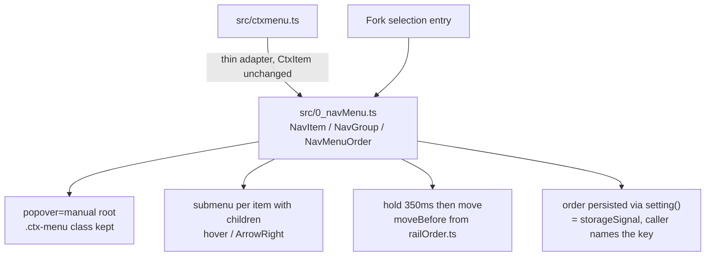

# Nav menu with submenus and hold-to-reorder: buy vs build

1. The runtime this ships into
2. Table (a): menu + submenu
3. Verdict (a)
4. Table (b): drag reorder inside groups
5. Verdict (b)
6. What gets built
7. Sources

## 1. The runtime this ships into

| fact | value | how it was read |
|---|---|---|
| host | Tauri v2 webview = WKWebView | `package.json` `@tauri-apps/api ^2` |
| engine version | macOS 14.6.1 (23G93) -> Safari 17.6 | `sw_vers` |
| Popover API | Safari 17.0, Chrome 114, Firefox 125, Baseline Widely | modern-css skill 3.1 |
| CSS anchor positioning | full only on Chrome/Edge 151+, Safari 27+; Firefox 147 partial | modern-css skill 3.2 |
| anchor polyfill already installed | `@oddbird/css-anchor-positioning/fn`, loaded at boot behind `CSS.supports("left: anchor(--x right)")` | `src/main.ts:16-19,334-336` |
| existing menu | `src/ctxmenu.ts`, 88 lines, `CtxItem`, `showContextMenu(x, y, items)`, `wireContextMenu(itemsFor)` | `wc -l`, file |
| its call sites | 10 calls in 6 modules: rail 1, sprefa 1, terminal 1, reactdock 1, worktrees 5, ctxmenu itself 1 | `grep -c "showContextMenu("` |
| existing pointer drag reorder | `rail.ts wireDragReorder` (4 px threshold, `setPointerCapture`, live node move) over pure `railOrder.ts moveBefore/mergeOrder` | files, `railOrder.test.ts` |
| UI idiom | imperative DOM + `@hafley66/signals`; React only inside dockview panels | `src/*.ts` vs `src/*.tsx` |

Two facts decide most of what follows: anchor positioning is **not** available on
this engine (so a menu library's headline positioning feature has to be
polyfilled or hand-measured either way), and 10 existing call sites already
speak `CtxItem`.

## 2. Table (a): menu + submenu

| candidate | submenu support | keyboard / aria | pointer positioning + edge flip | dependency weight | fits `@hafley66/signals` as the state model | verdict |
|---|---|---|---|---|---|---|
| native `popover` + `anchor-name`/`position-anchor` + `[role=menu]` roving tabindex | none: `popover` is a display primitive, nesting is manual (`popover=manual` per level, own dismiss chain) | none: every key handler is yours; the ARIA menu pattern is ~60 lines | `position-area` + `position-try-fallbacks` would do it, but the engine here lacks anchor positioning; the installed polyfill drives it off `requestAnimationFrame` | zero new deps; `popover` alone buys top-layer stacking over xterm and dockview | perfect: no state model of its own | **adopt the `popover` half**, hand-measure position |
| Floating UI `@floating-ui/dom` | none: it positions a box, submenus are yours | none | yes, `flip`/`shift`/`offset` middleware, virtual reference for a pointer | 1.8.0, 174 KB unpacked (npm `dist.unpackedSize`) | neutral: pure functions, no framework | no: it replaces the 12 lines of measure-and-flip `ctxmenu.ts` already has and solves nothing else on the list |
| Radix `@radix-ui/react-dropdown-menu` | yes, `Sub`/`SubTrigger`/`SubContent`, typeahead, correct roles | best in class | yes (Floating UI inside) | 2.1.24, 107 KB unpacked, plus a React tree per menu and its peer packages | poor: state is React context; every open would mount a React root from vanilla call sites | no: the menus here are built imperatively from 6 non-React modules |
| Base UI `@base-ui-components/react` | yes, Menu with nested submenus, same lineage as Radix | best in class | yes | 1.0.0-rc.0, 4.33 MB unpacked, release candidate | poor, same reason as Radix | no: React-bound and pre-1.0 |
| Kobalte `@kobalte/core` | yes | yes | yes | 0.13.13, 3.67 MB unpacked | no: Solid-only reactivity, a second reactive runtime alongside signals | no |
| existing `src/ctxmenu.ts` | none: `CtxItem` is `{label, action, disabled}` or `{sep}` | Escape only; no roles, no arrows | yes, already: off-screen measure, clamp and flip on both axes | zero | already imperative; nothing to adapt | **extend**: it is the shape 10 call sites speak |

## 3. Verdict (a)

**Build one module in-repo (`src/0_navMenu.ts`), reusing `ctxmenu.ts`'s measure-and-flip
maths, adopting native `popover=manual` for the top layer, and keeping the `.ctx-menu`
class names so every skin still styles it. `ctxmenu.showContextMenu` becomes a thin
adapter over it.**

The trade-off, stated plainly: a headless library (Radix, Base UI, Kobalte) would hand
over submenu behaviour, typeahead and a fully correct ARIA menu implementation that this
module will only approximate (arrows, Enter, Escape, ArrowRight/Left for submenus, no
typeahead in pass one). What it would cost is a React or Solid runtime at every one of
10 imperative call sites, plus 107 KB to 4.3 MB, to gain positioning this repo already
has working and a submenu that is one nested element with a rect. Floating UI is the
narrowest buy and still only covers the part that is already done.

The one genuine library win being left on the table is a11y depth: if the menus ever
need screen-reader-grade typeahead and full `aria-activedescendant` handling, revisit
Base UI once it leaves rc, and revisit it for the whole app rather than for this menu.

## 4. Table (b): drag reorder inside groups

The gesture Chris asked for is press-and-hold, then move, with items unable to leave
their harness group.

| candidate | nested/grouped constraint (an item cannot leave its group) | touch / pointer | a11y | bundle | verdict |
|---|---|---|---|---|---|
| native HTML5 drag-and-drop (`draggable`, `dragstart`/`dragover`/`drop`) | expressible: check the drop target's group in `dragover` and refuse | mouse only in practice; no touch on iOS/WebKit without a shim; no press-and-hold gesture at all (drag starts immediately) | keyboard-inaccessible by default | zero | no: the gesture asked for is press-and-hold, which this API cannot express, and a drag image inside a top-layer popover is unreliable |
| `@atlaskit/pragmatic-drag-and-drop` | yes: `canDrop` per drop target, plus `@atlaskit/pragmatic-drag-and-drop-hitbox` for edge-based reordering | yes, pointer + touch; built on native DnD with its own gesture layer | best of the buy options: ships live-region announcements as an add-on package | 3.1.0, 505 KB unpacked | strongest buy; revisit if reorder spreads past menus and the rail |
| SortableJS | groups exist (`group: { name, pull, put }`), so the constraint is one option | yes, including `delay`/`delayOnTouchOnly` press-and-hold | none beyond focus order | 1.15.7, 640 KB unpacked | close second; the press-and-hold `delay` option is exactly the gesture, but it owns the DOM list and wants a stable container, which a menu rebuilt per open is not |
| dnd-kit `@dnd-kit/core` | yes, sortable + constraints | yes, `PointerSensor` with `activationConstraint: { delay }` | good | 6.3.1, 1.07 MB unpacked | no: React-only. instant's menus are imperative DOM in 6 non-React modules |
| hand-rolled pointer events over `railOrder.ts` | trivially: the move is refused when `groupOf(drag) !== groupOf(over)`, one line | pointer events cover mouse, trackpad and touch in one path | must be added by hand (arrow-key move) | zero | **build** |

## 5. Verdict (b)

**Hand-rolled pointer events, reusing `mergeOrder` from `src/railOrder.ts`,
with a hold timer to arm the drag.**

One correction found while building: `railOrder.moveBefore` removes the dragged
id and then inserts it *before* the id it was dropped on, so dragging a row one
slot downward is a no-op (the removal already shifted the target). A menu drag
has to move on the first row crossed, so `0_navMenu.moveWithin` inserts at the
index the drop target held instead. The rail keeps its own version; whoever
merges the two gestures later has to reconcile this.

`rail.ts:167-215` already ships this exact gesture against these exact pure
functions, unit-tested in `railOrder.test.ts`; the menu adds a hold delay and a
group predicate. The trade-off: SortableJS's `delay` option and pragmatic-dnd's
`canDrop` would each cover the same ground with a maintained library and, in
pragmatic's case, real a11y announcements. Both assume a list that outlives the
gesture; a context menu is created on open and destroyed on dismiss, so the
library would be initialised and torn down per right-click, and the persisted
order would still be this repo's own `NavMenuOrder` either way. Second copy of a
drag gesture in the codebase is the cost being accepted, and it is the argument
for extracting the rail's version into the same module later.

## 6. What gets built

## 7. Sources

| source | used for |
|---|---|
| `~/projects/claude-research/skills/modern-css/SKILL.md` sections 2, 3.1, 3.2, 4 | Popover Baseline, anchor-positioning support tier, `[popover] { margin: unset }` gotcha |
| `npm view <pkg> version dist.unpackedSize` | every size in the tables |
| `sw_vers` | engine version |
| `src/ctxmenu.ts`, `src/rail.ts`, `src/railOrder.ts`, `src/main.ts` | in-repo precedent |
| <https://caniuse.com/css-anchor-positioning> | anchor positioning matrix (via skill) |
| <https://web.dev/blog/popover-baseline> | Popover Baseline (via skill) |
